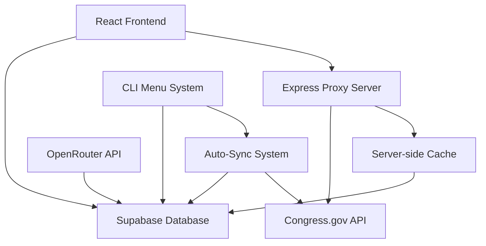
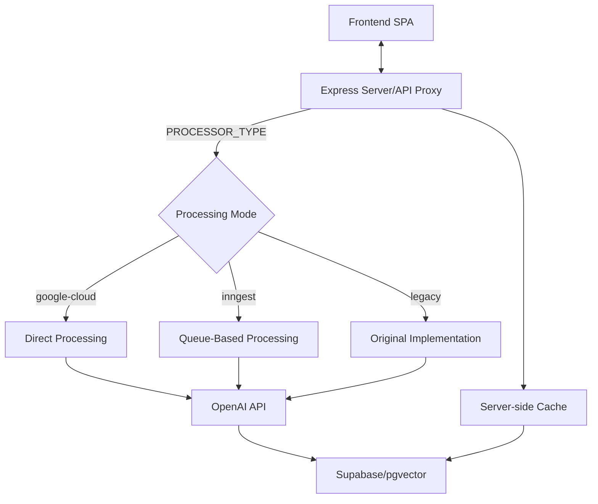
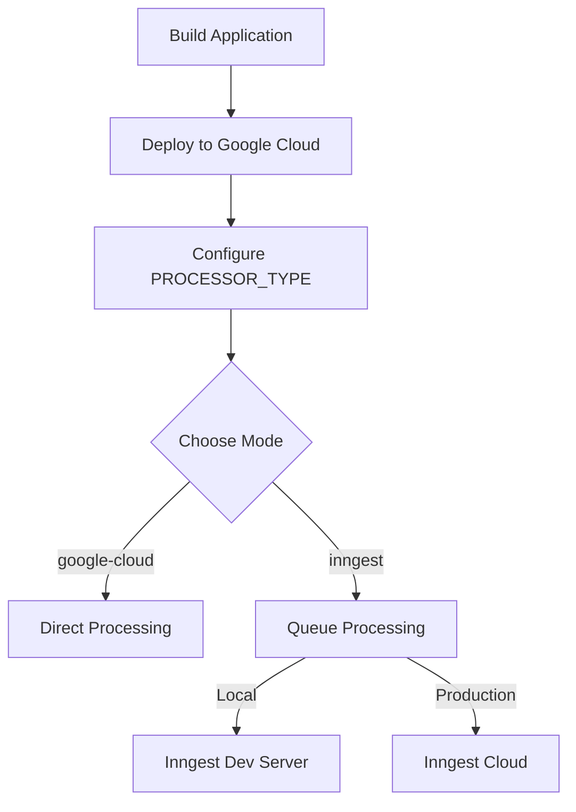
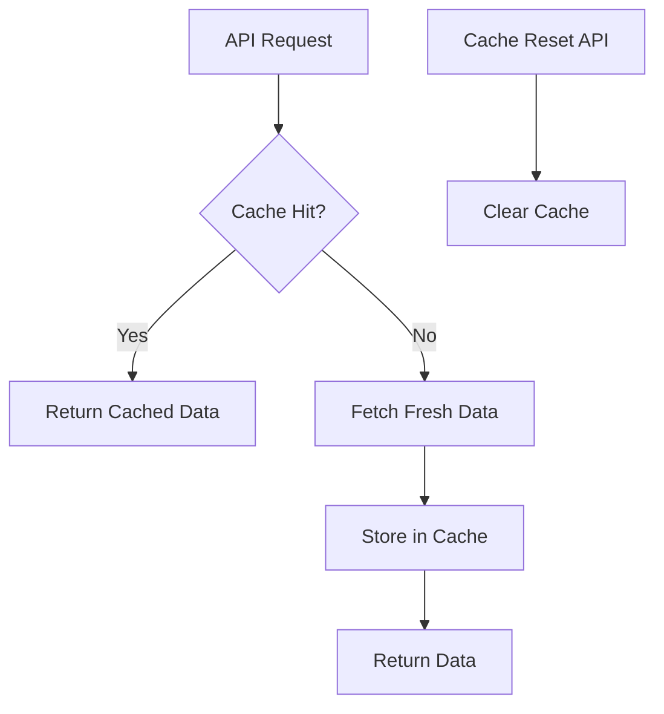
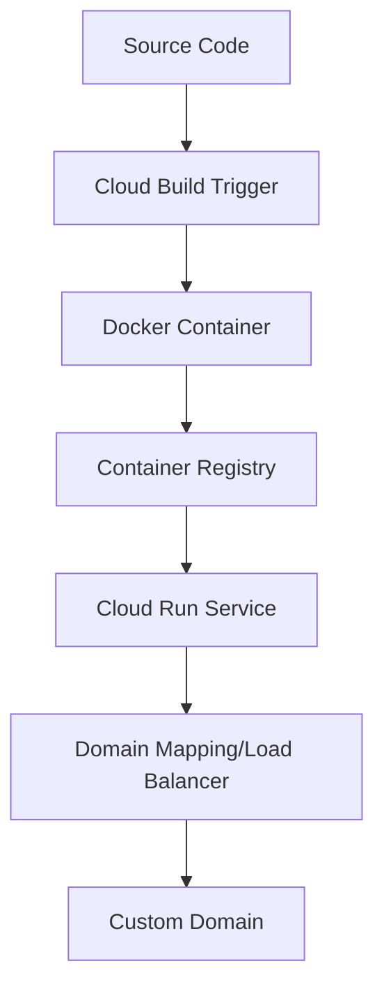
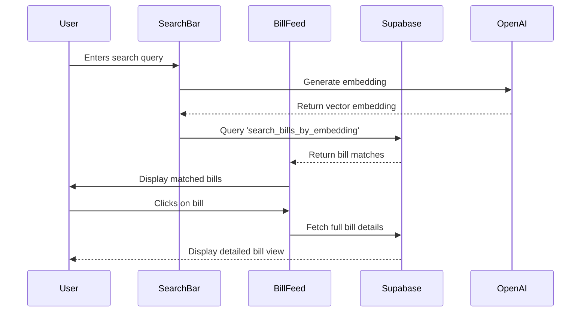

# Bill Tracker Knowledge Base

This document provides comprehensive information about the Bill Tracker application, including its architecture, components, database schema, API integrations, and operational procedures.

## 🌐 System Overview

The Bill Tracker is a modern web application that tracks, analyzes, and displays congressional bills. It uses a React frontend with TypeScript and a Supabase backend, integrating with the Congress.gov API for real-time bill data.

### Key Components

1. **Frontend**: React/TypeScript application built with Vite
2. **Backend**: Express server for proxying PDF requests and handling API calls
3. **Database**: Supabase (PostgreSQL) for data storage
4. **AI Integration**: OpenRouter API for bill analysis
5. **Sync System**: Automated data synchronization from Congress.gov
6. **Deployment**: Google Cloud Run with domain management
7. **Caching System**: Server-side LRU cache for high-performance data retrieval

### System Architecture



### Hybrid Processing Architecture

The system uses a hybrid approach for handling intensive operations like semantic search and PDF proxying, allowing for seamless switching between direct processing and queue-based processing:



#### Processing Modes

1. **Google Cloud Processing** (`PROCESSOR_TYPE=google-cloud`):
   - Direct synchronous processing
   - Immediate results returned to clients
   - Utilizes Google Cloud credits
   - Limited scalability with high concurrency

2. **Inngest Processing** (`PROCESSOR_TYPE=inngest`):
   - Queue-based asynchronous processing
   - Background job execution with caching
   - Better handling of rate limits
   - Scales to 1000+ concurrent users
   - Polling mechanism for results

3. **Legacy Processing** (`PROCESSOR_TYPE=legacy`):
   - Original implementation before hybrid approach
   - Simple direct processing
   - No special scaling features

#### Deployment Flow



## 🔄 Caching System

The application implements a sophisticated caching system to improve performance and reduce database load.

### Server-Side Caching

The server-side caching system uses an LRU (Least Recently Used) strategy with the following characteristics:

1. **Cache TTL**: 24-hour time-to-live for all cached items
2. **Maximum Size**: 500 entries with LRU eviction policy
3. **Cache Types**:
   - Bill statistics cache
   - Trending bills cache
   - Semantic search cache



### Cache Reset Functionality

The system provides endpoints to reset various caches:

- `/api/bill-stats/reset` - Resets bill statistics cache
- `/api/trending-bills/reset` - Resets trending bills cache
- `/api/semantic-search/reset` - Resets semantic search cache

A convenience script `reset-cache.sh` is provided to reset all caches at once.

### Database Caching

In addition to server-side caching, the system also maintains a database cache table:

- `cached_statistics` - Stores bill statistics with expiration timestamps
- Accessible by other services that don't share the server-side cache

## 🔐 Environment Management

The application uses a structured approach to environment management:

### Environment Files

- `.env.production` - Production environment variables
- `.env.staging` - Staging environment variables
- `.env.production.proxy` - Production with proxy configuration
- `.env.staging.proxy` - Staging with proxy configuration

Example files (`.env.production.example` and `.env.staging.example`) are provided as templates.

### Environment Variables

Key environment variables include:

- `VITE_SUPABASE_URL` - Supabase project URL
- `SUPABASE_SERVICE_ROLE_KEY` - Supabase service role key
- `VITE_CONGRESS_API_KEY` - Congress.gov API key
- `VITE_OPENROUTER_API_KEY` - OpenRouter API key for AI analysis
- `SERVER_URL` - URL for the Express server

### Terraform Configuration

For infrastructure deployment, Terraform variables are managed in:

- `auto-sync/terraform/production.tfvars` - Production infrastructure variables
- `auto-sync/terraform/staging.tfvars` - Staging infrastructure variables

Example files are provided in the repository.

### Security Practices

- All sensitive files are excluded from Git via `.gitignore`
- Scripts are configured to load only from `.env.production` or `.env.staging`
- Clear error messages when required environment variables are missing

## 💾 Database Schema

The database is structured around several key tables:

### Bills Table

Primary table storing information about congressional bills:

```sql
CREATE TABLE bills (
    id UUID PRIMARY KEY,
    bill_number VARCHAR NOT NULL,
    congress VARCHAR NOT NULL,
    title TEXT NOT NULL,
    introduction_date TIMESTAMP WITH TIME ZONE,
    key_points TEXT[] DEFAULT '{}',
    analysis TEXT,
    status bill_status NOT NULL DEFAULT 'introduced',
    analysis_status VARCHAR NOT NULL DEFAULT 'pending',
    sponsors TEXT[] DEFAULT '{}',
    committee TEXT,
    full_text TEXT,
    has_full_text BOOLEAN DEFAULT FALSE,
    text_source text_source_type NULL,
    related_bills JSONB DEFAULT '[]',
    bill_type VARCHAR,
    origin_chamber VARCHAR,
    origin_chamber_code VARCHAR,
    latest_action_date TIMESTAMP WITH TIME ZONE,
    latest_action_text TEXT,
    constitutional_authority_text TEXT,
    policy_area VARCHAR,
    subjects TEXT[] DEFAULT '{}',
    summary TEXT,
    cbo_cost_estimates JSONB DEFAULT '[]',
    laws JSONB DEFAULT '[]',
    committees_count INTEGER DEFAULT 0,
    cosponsors_count INTEGER DEFAULT 0,
    withdrawn_cosponsors_count INTEGER DEFAULT 0,
    actions_count INTEGER DEFAULT 0,
    update_date TIMESTAMP WITH TIME ZONE,
    update_date_including_text TIMESTAMP WITH TIME ZONE,
    pdf_url TEXT,
    created_at TIMESTAMP WITH TIME ZONE DEFAULT timezone('utc', now()),
    updated_at TIMESTAMP WITH TIME ZONE DEFAULT timezone('utc', now())
);
```

### Bill Status History Table

Tracks changes in bill status over time:

```sql
CREATE TABLE bill_status_history (
    id UUID PRIMARY KEY DEFAULT gen_random_uuid(),
    bill_id UUID NOT NULL REFERENCES bills(id) ON DELETE CASCADE,
    status bill_status NOT NULL,
    changed_at TIMESTAMP WITH TIME ZONE DEFAULT timezone('utc', now()),
    action_text TEXT
);
```

### Bill PDFs Table

Stores binary PDF data for bills:

```sql
CREATE TABLE bill_pdfs (
    id UUID PRIMARY KEY REFERENCES bills(id) ON DELETE CASCADE,
    pdf_data BYTEA NOT NULL,
    created_at TIMESTAMP WITH TIME ZONE DEFAULT timezone('utc', now()) NOT NULL,
    updated_at TIMESTAMP WITH TIME ZONE DEFAULT timezone('utc', now()) NOT NULL
);
```

### AI-Related Tables

Tables for AI model configuration and bill analysis:

```sql
CREATE TABLE ai_models (
    id UUID PRIMARY KEY DEFAULT uuid_generate_v4(),
    name VARCHAR NOT NULL,
    provider VARCHAR NOT NULL DEFAULT 'openrouter',
    model_id VARCHAR NOT NULL,
    is_active BOOLEAN DEFAULT false,
    cost_per_1k_tokens DECIMAL(10,6),
    max_tokens INTEGER,
    created_at TIMESTAMP WITH TIME ZONE DEFAULT timezone('utc', now()),
    updated_at TIMESTAMP WITH TIME ZONE DEFAULT timezone('utc', now())
);

CREATE TABLE ai_prompts (
    id UUID PRIMARY KEY DEFAULT uuid_generate_v4(),
    name VARCHAR NOT NULL,
    system_prompt TEXT NOT NULL,
    user_prompt TEXT NOT NULL,
    is_active BOOLEAN DEFAULT false,
    created_at TIMESTAMP WITH TIME ZONE DEFAULT timezone('utc', now()),
    updated_at TIMESTAMP WITH TIME ZONE DEFAULT timezone('utc', now())
);

CREATE TABLE bill_analyses (
    id UUID PRIMARY KEY DEFAULT uuid_generate_v4(),
    bill_id UUID REFERENCES bills(id) ON DELETE CASCADE,
    model_id UUID REFERENCES ai_models(id),
    prompt_id UUID REFERENCES ai_prompts(id),
    raw_response TEXT,
    processed_response JSONB,
    tokens INTEGER,
    cost DECIMAL(10,6),
    processing_duration DECIMAL(10,2),
    created_at TIMESTAMP WITH TIME ZONE DEFAULT timezone('utc', now()),
    updated_at TIMESTAMP WITH TIME ZONE DEFAULT timezone('utc', now())
);
```

### Sync Logs Table

Tracks automated synchronization runs:

```sql
CREATE TABLE sync_logs (
    id BIGSERIAL PRIMARY KEY,
    timestamp TIMESTAMP WITH TIME ZONE NOT NULL,
    success BOOLEAN NOT NULL,
    duration_ms INTEGER NOT NULL,
    environment TEXT NOT NULL,
    error TEXT,
    created_at TIMESTAMP WITH TIME ZONE DEFAULT TIMEZONE('utc', NOW())
);
```

### Bill Actions Table

Stores detailed information about actions taken on bills:

```sql
CREATE TABLE bill_actions (
    id UUID PRIMARY KEY DEFAULT gen_random_uuid(),
    bill_id UUID NOT NULL REFERENCES bills(id) ON DELETE CASCADE,
    action_text TEXT NOT NULL,
    action_date TIMESTAMP WITH TIME ZONE,
    created_at TIMESTAMP WITH TIME ZONE DEFAULT timezone('utc', now()),
    updated_at TIMESTAMP WITH TIME ZONE DEFAULT timezone('utc', now())
);
```

### Failed Bills Table

Tracks bills that failed to sync properly for retry and troubleshooting:

```sql
CREATE TABLE failed_bills (
    id UUID PRIMARY KEY DEFAULT uuid_generate_v4(),
    congress VARCHAR NOT NULL,
    bill_type VARCHAR NOT NULL,
    bill_number VARCHAR NOT NULL,
    title TEXT,
    error_message TEXT NOT NULL,
    retry_count INTEGER DEFAULT 0,
    last_retry TIMESTAMP WITH TIME ZONE,
    status VARCHAR NOT NULL DEFAULT 'failed',
    created_at TIMESTAMP WITH TIME ZONE DEFAULT timezone('utc', now()),
    updated_at TIMESTAMP WITH TIME ZONE DEFAULT timezone('utc', now()),
    UNIQUE(congress, bill_type, bill_number)
);
```

## 🔌 API Integrations

### Congress.gov API

Used to fetch bill data from the official Congress.gov API:

- **Base URL**: `https://api.congress.gov/v3`
- **Authentication**: API key required in requests
- **Rate Limits**: Limited to 10 requests per second
- **Key Functions**:
  - `fetchRecentBills()`: Get recently introduced bills
  - `fetchBillPDF()`: Get PDF version of a bill
  - `getCurrentCongress()`: Calculate the current Congress number

### OpenRouter API

Used for AI analysis of bill content:

- **Base URL**: `https://openrouter.ai/api/v1/chat/completions`
- **Model**: `anthropic/claude-3-opus`
- **Authentication**: Bearer token
- **Key Functions**:
  - `analyzeBillContent()`: Send bill text for AI analysis

## 🔄 Sync System

The bill synchronization system operates in two modes:

### Manual Sync via CLI Menu

Triggered through the CLI menu system:

```bash
npm run menu
```

Options include:
- Sync from Congress.gov API
- Parallel sync for faster processing
- Force refresh existing bills
- Save PDFs during sync

### Automated Sync via Google Cloud

Configured through Terraform:

1. **Components**:
   - Google Compute Engine VM (e2-standard-2)
   - Cloud Scheduler (daily trigger)
   - Storage Bucket (script storage)

2. **Process**:
   - Cloud Scheduler triggers VM creation
   - VM downloads and runs syncBillsParallel.ts script
   - Script processes 100 bills from Congress 119 in parallel
   - Results logged to `sync_logs` table
   - VM self-terminates after completion

3. **Configuration**:
   - Located in `/auto-sync/terraform/`
   - Customizable via `.tfvars` files
   - Separate environments for staging/production

4. **Current Status**: Not functioning correctly - needs to be updated to use syncBillsParallel.ts instead of sync.js

### Parallel Sync Implementation

The `syncBillsParallel.ts` script is the recommended method for syncing bills, both manually and through scheduled tasks:

1. **Key Features**:
   - Multi-threaded processing (configurable number of threads)
   - Real-time progress tracking with detailed statistics
   - Support for different environments (staging/production)
   - Configurable parameters (limit, offset, congress)
   - PDF handling and text extraction
   - Robust error handling with automatic retries
   - Comprehensive statistics on bill processing success rates
   - **Advanced API Rate Limit Handling** with exponential backoff and retry strategies

2. **Command-line Options**:
   - `--production` / `--staging`: Set environment
   - `--limit=N`: Number of bills to process (default: 100)
   - `--offset=N`: Starting offset for pagination
   - `--threads=N`: Number of parallel workers (default: 4)
   - `--congress=N`: Specific congress to process
   - `--save-pdfs`: Save PDF data to database

3. **Recommended Usage for Scheduled Tasks**:
   ```bash
   npx ts-node syncBillsParallel.ts --production --limit=100 --threads=5 --congress=119 --offset=0
   ```

4. **Example Usage for Manual Runs**:
   ```bash
   # Sync 100 bills from Congress 119 in staging environment
   npm run sync:bills:parallel:staging -- --congress=119 --limit=100
   
   # Sync with 6 worker threads in production environment
   npm run sync:bills:parallel:prod -- --congress=119 --limit=200 --threads=6
   ```

5. **Implementation Details**:
   - Creates worker threads for parallel processing
   - Each worker processes a batch of bills
   - Workers fetch bill data from Congress.gov API
   - Extracts text from PDFs when available
   - Updates bills table and related tables
   - Records bill actions and status changes
   - Logs failed bills for retry
   - Provides real-time console output with progress bars and statistics
   - Reports success rates for bill synchronization and text extraction
   - **Intelligently handles API rate limits** by respecting the `retry-after` header from the Congress.gov API
   - **Uses exponential backoff** when no `retry-after` header is provided (waiting time increases with each retry)
   - **Maximum retries** configurable to prevent infinite loops (default: 5 attempts)

6. **Rate Limit Handling**:
   - Detects 429 (Too Many Requests) responses from the API
   - Extracts and respects the `retry-after` header value to know exactly how long to wait
   - Falls back to exponential backoff strategy if the header isn't available (2^retryCount * 30 seconds)
   - Provides detailed logging about retry attempts, waiting time, and progress
   - Continues processing the same request after the wait period without skipping data
   - Throws an error after exceeding the maximum retry limit (5 attempts by default)
   - Ensures no data is lost due to rate limiting by properly pausing and resuming requests

7. **Performance Metrics**:
   - Processing speed varies based on API response times
   - With 4 workers, typically processes 100 bills in 5-10 minutes
   - Text extraction success rate varies by congress (typically 15-30%)
   - API-based text extraction is preferred over PDF parsing when available
   - Memory usage scales with number of worker threads
   - Rate limit handling ensures reliable processing even with large datasets

8. **Output Information**:
   - Displays global progress as a percentage and progress bar
   - Shows per-worker statistics (bills processed, success rate, text extraction rate)
   - Reports current bill being processed by each worker
   - Provides final summary statistics on completion
   - Clearly indicates any failed bills for troubleshooting
   - Shows detailed rate limit information when encountered (waiting time, retry count)

## 📋 CLI Menu System

The application includes a comprehensive CLI menu system (`npm run menu`) for management tasks:

### Main Features

1. **Environment Management**:
   - Switch between staging and production
   - View and edit environment variables

2. **Bill Synchronization**:
   - Manual sync from Congress.gov API
   - Parallel sync for better performance
   - Selective sync by Congress number

3. **Database Management**:
   - Reset database (clean slate)
   - Create new database structure
   - Update existing database

4. **Bill Analysis**:
   - Analyze bill content using AI
   - Force re-analysis of bills
   - Extract and OCR PDF content

5. **Domain Management**:
   - Setup custom domains
   - Manage SSL certificates
   - Configure Cloudflare integration

## 🚢 Deployment Architecture

The application is deployed using Google Cloud Run:

### Components

1. **Docker Container**:
   - Node.js application
   - Nginx for static file serving
   - Express server for API proxying

2. **Cloud Run Service**:
   - Auto-scaling based on demand
   - Regional deployment
   - Automated CI/CD via Google Cloud Build

3. **Custom Domain Setup**:
   - Direct domain mapping option
   - Global load balancer option
   - Cloudflare integration

### Deployment Process



## 🔧 Common Operations

### Setting Up Development Environment

```bash
# Install dependencies
npm install

# Setup environment variables
cp .env.sample .env
# Edit .env with your credentials

# Start development server
npm run dev
# or with proxy
npm run dev:proxy
```

### Syncing Bills from Congress.gov

```bash
# Using the menu system (recommended)
npm run menu
# Select option for bill sync

# Direct script execution
npm run sync:bills:congressapi
# or for production
npm run sync:bills:congressapi:prod
```

### Database Management

```bash
# Reset database to clean state
npm run db:reset

# Create new database structure
npm run db:new

# Update existing database
npm run db:update
```

### Building for Production

```bash
# Standard production build
npm run build:production

# With proxy configuration
npm run build:production.proxy
```

## 🛠️ Troubleshooting

### Auto-Sync Issues

The auto-sync system is currently not functioning correctly. Based on analysis, the key issues include:

1. **Incorrect Script Reference**:
   - Current implementation tries to use sync.js which is not the main sync tool
   - Should be using syncBillsParallel.ts which is used in the CLI menu

2. **Dependencies Missing**:
   - The cloud startup script is missing necessary dependencies for TypeScript
   - Needs ts-node and other dependencies installed

3. **Environment Variables Mismatch**:
   - The auto-sync script expects different environment variables than provided
   - Need to align environment variable names with syncBillsParallel.ts requirements

4. **Script Location Issues**:
   - The script should be pulling from the correct GCS bucket location
   - Need to ensure the syncBillsParallel.ts file is properly uploaded to GCS

To fix these issues:
1. Update the startup-script.sh to use syncBillsParallel.ts instead of sync.js
2. Install all necessary dependencies (including TypeScript and ts-node)
3. Correctly configure environment variables for syncBillsParallel.ts
4. Upload the syncBillsParallel.ts file to the GCS bucket
5. Ensure the Cloud Scheduler job properly creates the VM instance

### Database Sync Problems

If bills are not syncing correctly:

1. Check Congress.gov API status
2. Verify API keys are valid
3. Examine error logs in the database
4. Try running with `--force` flag

### SSL Certificate Issues

When setting up custom domains:

1. **Certificate Not Provisioning**:
   - Ensure DNS records are correctly set
   - Verify ACME challenge record is DNS-only
   - Wait 15-30 minutes for provisioning

2. **Domain Not Resolving**:
   - Check A/AAAA records
   - Verify Cloudflare proxy settings
   - Confirm Google Cloud domain mapping status

## 📚 External Resources

- [Congress.gov API Documentation](https://api.congress.gov/docs/)
- [Supabase Documentation](https://supabase.io/docs)
- [OpenRouter API Documentation](https://openrouter.ai/docs)
- [Google Cloud Run Documentation](https://cloud.google.com/run/docs)
- [Terraform Documentation](https://www.terraform.io/docs)

## Terraform Infrastructure

### Auto-Sync Terraform Setup

The project uses Terraform to manage infrastructure for the auto-sync functionality in both staging and production environments. The following resources are deployed:

1. **Google Cloud Storage Bucket**: 
   - `dogeplotfun-sync-scripts-staging` and `dogeplotfun-sync-scripts-production`
   - Stores the scripts needed for bill synchronization
   - Contains lifecycle rules to delete objects after 30 days

2. **Script Files**:
   - `syncBillsParallel.ts`: The main synchronization script
   - `loadEnv.ts`: Helper script for loading environment variables

3. **Service Account**:
   - `bills-sync-staging@dogeplotfun.iam.gserviceaccount.com` (staging)
   - `bills-sync-production@dogeplotfun.iam.gserviceaccount.com` (production)
   - Permissions: Storage Object Viewer role

4. **Compute Instance Template**:
   - Defines VM configurations for bill sync instances
   - Uses e2-standard-2 machine type
   - Debian 11 as the base image
   - Contains metadata for environment variables (Supabase URL, API keys)

5. **Cloud Scheduler Job**:
   - Scheduled to run daily at midnight UTC
   - Uses HTTP target to trigger instance creation
   - Uses OAuth for authentication

### Managing Terraform Configuration

To manage the infrastructure:

```bash
# Initialize Terraform
cd auto-sync/terraform
terraform init

# Plan changes for staging environment
terraform plan -var-file=staging.tfvars

# Apply changes for staging environment
terraform apply -var-file=staging.tfvars

# Plan changes for production environment
terraform plan -var-file=production.tfvars

# Apply changes for production environment
terraform apply -var-file=production.tfvars
```

The environment-specific variables are stored in `staging.tfvars` and `production.tfvars` files, which include project ID, region, zone, Supabase credentials, Congress API key, and the synchronization schedule.

# Vector Embeddings and Semantic Search

## Overview

The Bill Tracker includes vector embedding capabilities, allowing for semantic search and similarity detection between bills. This feature uses OpenAI embeddings and Supabase's pgvector extension to create a powerful semantic search engine.

## 🔑 Key Components

1. **Vector Embeddings Generation**
   - Creates embeddings from bill text using OpenAI's text-embedding-3-small model
   - Stores embeddings in Supabase using pgvector extension
   - Configurable similarity thresholds and match counts per embedding
   - Tracks embedding model and version information

2. **Flexible Search Options**
   - **Semantic Search**: Find bills related to natural language queries
   - **Bill ID Search**: Find bills similar to a specific bill by UUID
   - **Bill Number Search**: Find bills similar to a specific bill using common formats (e.g., "hr1234", "S. 123")
   - **Parameter Control**: Adjust similarity thresholds, result limits, and filter by model/version

3. **Bill Number Search**
   - Supports multiple formats (e.g., "H.R. 1234", "hr1234", "S. 45")
   - Automatically normalizes input by removing spaces and dots
   - Maps common abbreviations to standard bill types
   - Supports all bill types: HR, S, HJRES, SJRES, HCONRES, SCONRES, HRES, SRES

## 🛠️ Usage Examples

1. **Command Line Usage**

   ```bash
   # Search by natural language query
   npx tsx src/scripts/searchVectorEmbeddings.ts --staging --query "climate change" --threshold 0.5
   
   # Search by bill UUID
   npx tsx src/scripts/searchVectorEmbeddings.ts --staging --similar "uuid-of-bill" --threshold 0.7
   
   # Search by bill number (flexible format)
   npx tsx src/scripts/searchVectorEmbeddings.ts --staging --bill "hr1234" --threshold 0.7
   npx tsx src/scripts/searchVectorEmbeddings.ts --staging --bill "H.R. 1234" --threshold 0.7
   npx tsx src/scripts/searchVectorEmbeddings.ts --staging --bill "s.123" --threshold 0.7
   
   # Filter by model and version
   npx tsx src/scripts/searchVectorEmbeddings.ts --staging --query "education" --modelFilter "text-embedding-3-small" --versionFilter 1
   ```

2. **Interactive Menu Usage**

   ```bash
   # Start the CLI menu
   npm run menu
   
   # For semantic search:
   # Select option 8e for "Semantic Search"
   # Choose option 1 for topic search or option 2 for bill number search
   
   # For finding similar bills:
   # Select option 8f for "Find Similar Bills"
   # Choose option 1 for UUID search or option 2 for bill number search
   ```

## 🔍 Technical Implementation

1. **Database Structure**

   ```sql
   CREATE TABLE bill_embeddings (
       id UUID PRIMARY KEY REFERENCES bills(id) ON DELETE CASCADE,
       embedding vector(1536),
       query_embedding vector(1536),
       similarity_threshold FLOAT DEFAULT 0.7,
       match_count INTEGER DEFAULT 5,
       embedding_model VARCHAR NOT NULL,
       embedding_version INTEGER NOT NULL DEFAULT 1,
       text_processed TEXT,
       created_at TIMESTAMP WITH TIME ZONE DEFAULT timezone('utc', now()),
       updated_at TIMESTAMP WITH TIME ZONE DEFAULT timezone('utc', now())
   );
   ```

2. **Search Functions**

   ```sql
   -- Semantic search function
   CREATE OR REPLACE FUNCTION search_bills_by_embedding(
       input_embedding vector(1536),
       input_match_threshold float DEFAULT 0.7,
       input_match_count int DEFAULT 5,
       input_model_filter varchar DEFAULT NULL,
       input_version_filter int DEFAULT NULL
   )
   RETURNS TABLE (
       id UUID,
       bill_number VARCHAR,
       congress VARCHAR,
       title TEXT,
       similarity float,
       embedding_model VARCHAR,
       embedding_version INTEGER
   );
   
   -- Similar bill search function
   CREATE OR REPLACE FUNCTION find_similar_bills(
       input_bill_id UUID,
       input_match_count int DEFAULT NULL,
       input_match_threshold float DEFAULT NULL,
       input_model_filter varchar DEFAULT NULL,
       input_version_filter int DEFAULT NULL
   )
   RETURNS TABLE (
       id UUID,
       bill_number VARCHAR,
       congress VARCHAR,
       title TEXT,
       similarity float,
       embedding_model VARCHAR,
       embedding_version INTEGER
   );
   ```

3. **Bill Number Normalization Logic**

   The bill number search feature implements a sophisticated normalization function that:
   
   - Converts input to lowercase and removes whitespace
   - Removes dots and other separators
   - Extracts bill type and number using regex
   - Maps common abbreviations to standard database values
   - Provides helpful error messages for invalid formats
   - Looks up the bill UUID in the database before performing similarity search

## 📋 Best Practices

1. **Similarity Thresholds**
   - Use higher thresholds (0.7-0.9) when finding similar bills by bill ID
   - Use lower thresholds (0.3-0.5) for more general text searches
   - Start with a threshold of 0.5 and adjust as needed for precision

2. **Bill Number Format Handling**
   - The system handles a wide variety of formats automatically
   - When typing bill numbers manually, any of these formats work:
     - Formal: "H.R. 1234", "S. 123", "H.J.Res. 45"
     - Abbreviated: "HR1234", "S123", "HJRES45"
     - Mixed case: "Hr1234", "s123", "HJres45"

3. **Performance Considerations**
   - Vector searches perform best with indexes (automatically created)
   - Large result sets (>20) may impact performance
   - For best performance, filter by model and version when possible

# Frontend Architecture and Technical Reference

## 🏗️ Overview

The frontend of the Bill Tracker application is built using modern React patterns with TypeScript, Vite, and a component-based architecture. It integrates directly with Supabase for data management and uses a variety of tools and libraries to provide a rich, interactive user experience.

## 🧰 Technical Stack

### Core Libraries

| Library                | Version  | Purpose                                      |
|------------------------|----------|----------------------------------------------|
| React                  | 18.2.0   | Component-based UI framework                 |
| TypeScript             | 5.7.3    | Static typing and enhanced IDE integration   |
| Vite                   | 5.2.0    | Fast build tool and development server       |
| React Router           | 6.23.1   | Client-side routing                          |
| Supabase JS Client     | 2.48.1   | Database access and authentication           |
| Tailwind CSS           | 3.4.1    | Utility-first CSS framework                  |
| Radix UI               | Various  | Accessible, unstyled UI components           |
| OpenAI                 | 4.86.1   | AI integration for analysis and embeddings   |
| date-fns               | 3.6.0    | Date formatting and manipulation             |
| Lucide React           | 0.394.0  | Icon library                                 |
| React Hook Form        | 7.51.5   | Form state management and validation         |
| Zod                    | 3.23.8   | Schema validation                            |

### Build Tools

- **SWC**: Fast TypeScript/JavaScript compiler (via Vite plugin)
- **PostCSS**: CSS transformations and Tailwind processing
- **TypeScript**: Type checking during build
- **Rollup**: Module bundling (via Vite)
- **ESLint**: Code linting and style enforcement

## 📊 Data Flow and State Management

### Data Sources

1. **Supabase Database**: Primary data source for bills and user preferences
   - Direct access via Supabase client
   - Real-time subscription capabilities for live updates
   - Row-level security for data access control

2. **Congress.gov API**: Secondary source for bill data
   - Accessed through backend proxy for authentication
   - Used for initial data population and updates

3. **OpenAI API**: Used for:
   - Bill text analysis
   - Vector embeddings for semantic search
   - AI-generated summaries and key points

### State Management Patterns

1. **Component State**: 
   - Local component state using `useState` hook
   - Ephemeral UI state (dropdowns, modals, form inputs)

2. **Context API**:
   - Theme context for dark/light mode
   - Potential for authentication context

3. **Database as State**:
   - Direct Supabase queries for persistent state
   - Bills, user preferences, saved searches

4. **URL Parameters**:
   - Storing search and filter parameters in URL
   - Enables shareable, bookmarkable states

### Data Flow Example: Bill Search and Display



## 🧩 Component Architecture

### Component Hierarchy

```
App
├── ThemeProvider
│   └── RouterProvider
│       ├── Home
│       │   ├── Header
│       │   │   ├── ThemeToggle
│       │   │   └── Navigation
│       │   └── BillFeed
│       │       ├── SearchBar
│       │       ├── Filters
│       │       ├── BillList
│       │       │   └── BillCard (multiple)
│       │       └── BillDialog
│       │           ├── BillHeader
│       │           ├── BillContent
│       │           │   ├── TextTab
│       │           │   ├── AnalysisTab
│       │           │   └── StatusTab
│       │           └── BillFooter
│       └── TestDashboard (dev only)
```

### Key Component Details

1. **BillFeed (`/src/components/BillFeed.tsx`)**
   - **Purpose**: Central component for displaying and filtering bills
   - **State**: 
     - Current filter settings
     - Search query
     - Pagination state
     - Selected bill for detailed view
   - **Props**: 
     - `onBillClick`: Handler for bill selection
     - `searchQuery`: Current search term
     - `filters`: Active filters object
   - **Data Flow**: 
     - Fetches bills from Supabase based on filters
     - Uses intersection observer for infinite scrolling
     - Passes bill data to child components

2. **BillDialog (`/src/components/BillDialog.tsx`)**
   - **Purpose**: Detailed view of a selected bill
   - **State**:
     - Active tab (text, analysis, status)
     - PDF loading state
     - Analysis loading state
   - **Props**:
     - `bill`: Full bill object with all details
     - `onClose`: Handler for closing dialog
   - **Features**:
     - Tabbed interface for different content views
     - PDF viewer for bill documents
     - Status timeline visualization
     - AI-generated analysis display

3. **SearchBar (`/src/components/SearchBar.tsx`)**
   - **Purpose**: Search interface for finding bills
   - **State**:
     - Current query
     - Search mode (text or semantic)
     - Suggestion list
   - **Props**:
     - `onSearch`: Handler for search submission
     - `placeholder`: Custom placeholder text
   - **Features**:
     - Text-based search
     - Vector semantic search
     - Autosuggestions
     - Search history

## 🔄 API Integration

### Supabase Integration

```typescript
// src/lib/supabase.ts
import { createClient } from "@supabase/supabase-js";
import type { Database } from "@/types/supabase";

const supabaseUrl = import.meta.env.VITE_SUPABASE_URL;
const supabaseAnonKey = import.meta.env.VITE_SUPABASE_ANON_KEY;

export const supabase = createClient<Database>(supabaseUrl, supabaseAnonKey);
```

### API Function Examples

1. **Fetching Bills**:
```typescript
// From src/lib/api.ts
export async function fetchBills(options: {
  limit?: number;
  offset?: number;
  searchQuery?: string;
  filters?: BillFilters;
}): Promise<{ data: Bill[]; count: number }> {
  const { limit = 10, offset = 0, searchQuery, filters } = options;
  
  let query = supabase
    .from('bills')
    .select('*', { count: 'exact' });
    
  // Apply filters and search conditions
  if (searchQuery) {
    query = query.ilike('title', `%${searchQuery}%`);
  }
  
  if (filters?.status !== 'all') {
    query = query.eq('status', filters.status);
  }
  
  // Apply pagination
  const { data, error, count } = await query
    .order('introduction_date', { ascending: false })
    .range(offset, offset + limit - 1);
    
  if (error) throw new Error(error.message);
  
  return { data: data || [], count: count || 0 };
}
```

2. **Vector Search**:
```typescript
// From src/lib/api.ts
export async function searchBillsByVector(embedding: number[], threshold: number, limit: number): Promise<Bill[]> {
  const { data, error } = await supabase.rpc('search_bills_by_embedding', {
    input_embedding: embedding,
    input_match_threshold: threshold,
    input_match_count: limit
  });
  
  if (error) throw new Error(error.message);
  
  return data || [];
}
```

3. **PDF Proxy**:
```typescript
// From src/lib/api.ts
export async function proxyPdf(url: string): Promise<Response> {
  const proxyEndpoint = `${API_URL}/proxy/pdf`;
  const encodedUrl = encodeURIComponent(url);
  const proxyUrl = `${proxyEndpoint}?url=${encodedUrl}`;
  
  const response = await fetch(proxyUrl, {
    mode: 'cors',
    credentials: 'include',
    headers: {
      'Accept': 'application/pdf,application/octet-stream,*/*'
    }
  });
  
  if (!response.ok) {
    throw new Error('Failed to proxy PDF');
  }
  
  return response;
}
```

## 🛠️ Build and Development Process

### Environment Configuration

The application uses a sophisticated environment configuration system:

```
.env                    # Base environment variables
.env.staging            # Staging-specific variables
.env.staging.proxy      # Staging with API proxy
.env.production         # Production-specific variables
.env.production.proxy   # Production with API proxy
```

The build process uses these environment files based on the specified mode:

```typescript
// vite.config.ts
export default defineConfig(({ mode }) => {
  const env = loadEnv(mode, process.cwd(), '');
  
  return {
    base: mode === "development" || mode === "staging" ? "/" : env.VITE_BASE_PATH || "/",
    define: {
      'process.env.NODE_ENV': mode.includes('production') ? '"production"' : '"development"',
      'import.meta.env': JSON.stringify({
        ...env,
        MODE: mode,
        DEV: mode !== 'production',
        PROD: mode === 'production',
      })
    },
    // Additional configuration...
  };
});
```

### Build Optimization

1. **Code Splitting**:
```javascript
// vite.config.ts
build: {
  chunkSizeWarningLimit: 1000,
  rollupOptions: {
    output: {
      manualChunks: {
        'react-vendor': ['react', 'react-dom', 'react-router-dom'],
        'ui-vendor': [
          '@radix-ui/react-accordion',
          '@radix-ui/react-alert-dialog',
          '@radix-ui/react-avatar',
          // Additional UI components...
        ],
      },
    },
  },
}
```

2. **TypeScript Optimization**:
```json
// tsconfig.json
{
  "compilerOptions": {
    "target": "ES2020",
    "useDefineForClassFields": true,
    "lib": ["ES2020", "DOM", "DOM.Iterable"],
    "module": "ESNext",
    "skipLibCheck": true,
    "moduleResolution": "bundler",
    "allowImportingTsExtensions": true,
    "resolveJsonModule": true,
    "isolatedModules": true,
    "noEmit": true,
    "jsx": "react-jsx",
    "strict": true,
    "noUnusedLocals": true,
    "noUnusedParameters": true,
    "noFallthroughCasesInSwitch": true,
    "paths": {
      "@/*": ["./src/*"]
    }
  },
  "include": ["src"],
  "references": [{ "path": "./tsconfig.node.json" }]
}
```

### Deployment Configuration

1. **Docker Setup**:
```dockerfile
# Dockerfile
FROM node:18-alpine AS builder

WORKDIR /app
COPY package*.json ./
RUN npm ci
COPY . .
RUN npm run build:production.proxy

FROM nginx:alpine

COPY --from=builder /app/dist /usr/share/nginx/html
COPY --from=builder /app/src/server/dist /app/server
COPY --from=builder /app/nginx.conf /etc/nginx/conf.d/default.conf

EXPOSE 80

CMD ["nginx", "-g", "daemon off;"]
```

2. **NGINX Configuration**:
```nginx
# nginx.conf
server {
  listen 80;
  
  location / {
    root /usr/share/nginx/html;
    index index.html;
    try_files $uri $uri/ /index.html;
  }
  
  location /proxy/ {
    proxy_pass http://localhost:3001/;
    proxy_http_version 1.1;
    proxy_set_header Upgrade $http_upgrade;
    proxy_set_header Connection 'upgrade';
    proxy_set_header Host $host;
    proxy_cache_bypass $http_upgrade;
  }
}
```

## 🧪 Development Practices

### Component Design Principles

1. **Composition over Inheritance**:
   - Building UIs through component composition
   - Using smaller, focused components that can be combined

2. **Props for Configuration**:
   - Using props to customize component behavior
   - Avoiding direct state coupling between components

3. **Custom Hooks for Logic Reuse**:
   - Extracting complex logic into custom hooks
   - Examples include state management, API calls, and effect logic

### Code Structure Conventions

1. **File Organization**:
   - Components in `/src/components`
   - Utilities in `/src/lib`
   - Pages in `/src/pages`
   - Types in `/src/types`

2. **Naming Conventions**:
   - PascalCase for React components
   - camelCase for functions and variables
   - UPPERCASE for constants
   - kebab-case for file names (except components)

3. **Import Order**:
   - React and core libraries first
   - Third-party libraries next
   - Local modules last, sorted by path depth

### Performance Considerations

1. **Memoization**:
   - Using `useMemo` for expensive calculations
   - Using `useCallback` for stable function references
   - Using `React.memo` for pure components that render often

2. **Code Splitting**:
   - Using dynamic imports for route-based code splitting
   - Separate vendor chunks for third-party libraries

3. **Rendering Optimization**:
   - Virtualization for long lists (via intersection observer)
   - Debounced inputs for search functionality
   - Pagination for large data sets