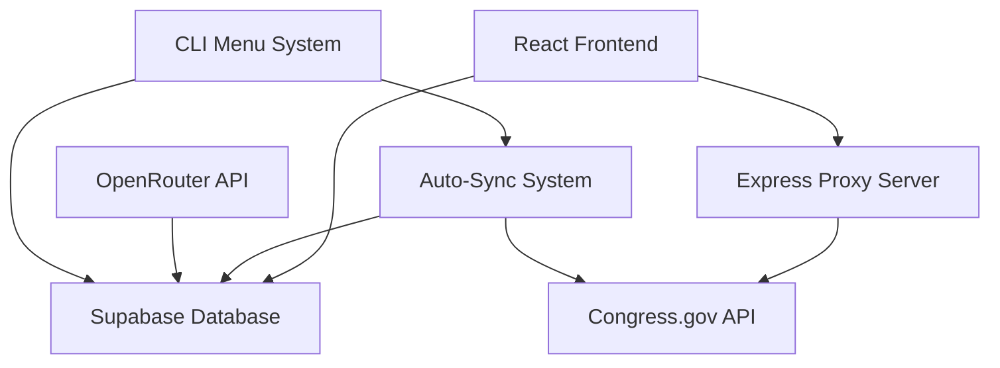
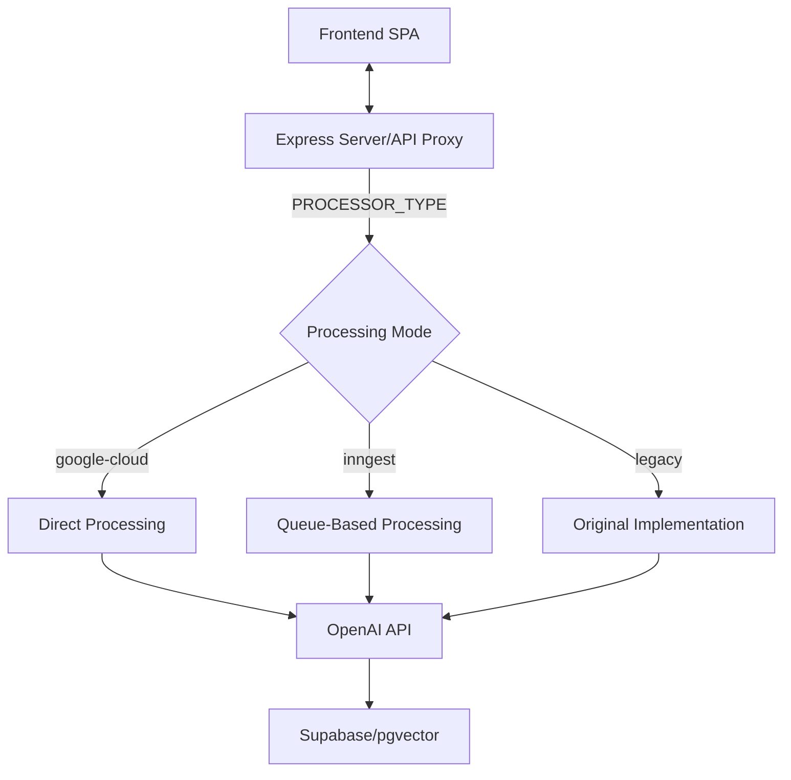
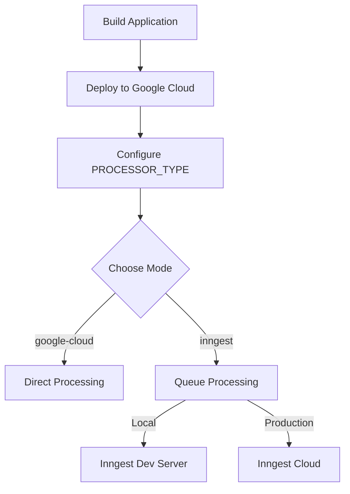
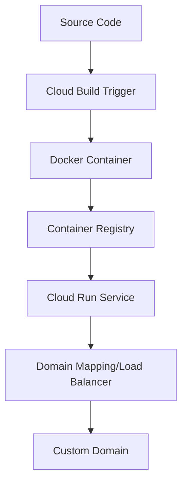
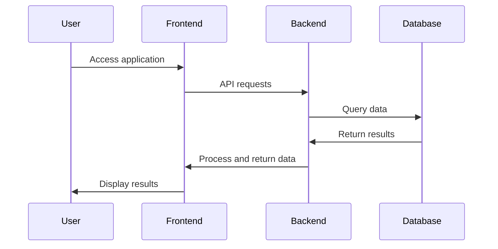
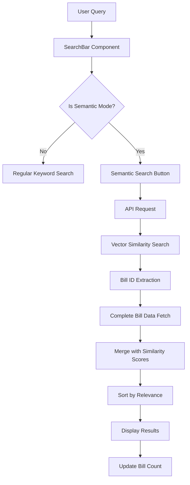
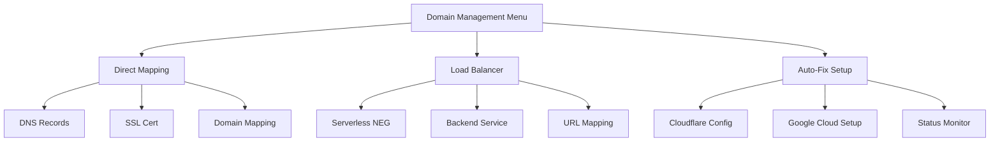
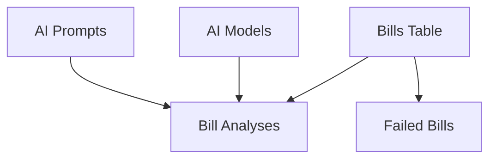

# Bill Tracker Knowledge Base

This document provides comprehensive information about the Bill Tracker application, including its architecture, components, database schema, API integrations, and operational procedures.

## 🌐 System Overview

The Bill Tracker is a modern web application that tracks, analyzes, and displays congressional bills. It uses a React frontend with TypeScript and a Supabase backend, integrating with the Congress.gov API for real-time bill data.

### Key Components

1. **Frontend**: React/TypeScript application built with Vite
2. **Backend**: Express server for proxying PDF requests and handling API calls
3. **Database**: Supabase (PostgreSQL) for data storage
4. **AI Integration**: OpenRouter API for bill analysis
5. **Sync System**: Automated data synchronization from Congress.gov
6. **Deployment**: Google Cloud Run with domain management

### System Architecture


```mermaid
graph TD
    A[React Frontend] --> B[Supabase Database]
    A --> C[Express Proxy Server]
    C --> D[Congress.gov API]
    E[Auto-Sync System] --> B
    E --> D
    F[OpenRouter API] --> B
    G[CLI Menu System] --> B
    G --> E
```

### Hybrid Processing Architecture

The system uses a hybrid approach for handling intensive operations like semantic search and PDF proxying, allowing for seamless switching between direct processing and queue-based processing:


```mermaid
graph TD
    A[Frontend SPA] <--> B[Express Server/API Proxy]
    B -->|PROCESSOR_TYPE| C{Processing Mode}
    C -->|google-cloud| D[Direct Processing]
    C -->|inngest| E[Queue-Based Processing]
    C -->|legacy| F[Original Implementation]
    D --> G[OpenAI API]
    E --> G
    F --> G
    G --> H[Supabase/pgvector]
```

#### Processing Modes

1. **Google Cloud Processing** (`PROCESSOR_TYPE=google-cloud`):
   - Direct synchronous processing
   - Immediate results returned to clients
   - Utilizes Google Cloud credits
   - Limited scalability with high concurrency

2. **Inngest Processing** (`PROCESSOR_TYPE=inngest`):
   - Queue-based asynchronous processing
   - Background job execution with caching
   - Better handling of rate limits
   - Scales to 1000+ concurrent users
   - Polling mechanism for results

3. **Legacy Processing** (`PROCESSOR_TYPE=legacy`):
   - Original implementation before hybrid approach
   - Simple direct processing
   - No special scaling features

#### Deployment Flow


```mermaid
graph TD
    A[Build Application] --> B[Deploy to Google Cloud]
    B --> C[Configure PROCESSOR_TYPE]
    C --> D{Choose Mode}
    D -->|google-cloud| E[Direct Processing]
    D -->|inngest| F[Queue Processing]
    F -->|Local| G[Inngest Dev Server]
    F -->|Production| H[Inngest Cloud]
```

## 🚀 Version 1.0.3 Updates

### New Features

#### Enhanced Semantic Search
- **Button-Triggered Search**: Semantic search now requires explicit button activation for better user control
- **Improved Results Display**: Search results show complete bill information with proper formatting
- **Real-Time Result Count**: "Bills analyzed" count updates instantly after search completion
- **Similarity Badges**: Visual indicators showing how closely each bill matches your search query
- **Threshold Control**: Adjustable similarity threshold to fine-tune search precision

#### Deployment Architecture
- **Separated Server Deployment**: Frontend and backend now deployed separately for better scaling
- **Improved Error Handling**: Better handling of null/undefined values in search results
- **Crash Prevention**: Enhanced stability for handling large numbers of concurrent requests
- **Port Conflict Management**: New restart script to manage server port conflicts

### Technical Improvements
- **State Management**: Added force re-render mechanisms for immediate UI updates
- **Type Safety**: Improved TypeScript typing for semantic search results
- **Error Recovery**: Graceful error handling with clear user feedback
- **Performance**: Optimized bill data fetching with complete information retrieval

### How to Use Semantic Search
1. Toggle the "Semantic Search" switch in the search bar
2. Enter your search query (e.g., "bills about climate change")
3. Click the "Search" button that appears
4. View results sorted by relevance with similarity scores

## 🔄 Environment Setup

The application supports multiple environments with different configuration files:

### Environment Files

- `.env`: Base environment variables
- `.env.staging`: Staging environment (no proxy)
- `.env.staging.proxy`: Staging with local API proxy
- `.env.production`: Production environment (no proxy)
- `.env.production.proxy`: Production with local API proxy

### Environment Variables

- `VITE_SUPABASE_URL`: Supabase instance URL
- `VITE_SUPABASE_ANON_KEY`: Supabase anonymous key
- `SUPABASE_SERVICE_ROLE_KEY`: Supabase service role key
- `VITE_CONGRESS_API_KEY`: Congress.gov API key
- `VITE_GOVINFO_API_KEY`: GovInfo API key
- `OPENROUTER_API_KEY`: OpenRouter API key
- `VITE_API_URL`: API endpoint (set for proxy modes)
- `BILL_LIMIT`: Maximum bills to fetch per sync (default: 25)
- `PROCESSOR_TYPE`: Processing mode (`google-cloud`, `inngest`, or `legacy`)

### Setup Process

1. Copy `.env.example
   ```bash
   cp .env.example .env
   ```

2. Edit with proper credentials
   ```
   VITE_SUPABASE_URL=your_supabase_url
   VITE_SUPABASE_ANON_KEY=your_supabase_anon_key
   VITE_OPENROUTER_API_KEY=your_openrouter_api_key
   VITE_CONGRESS_API_KEY=your_congress_api_key
   ```

3. Run development server
   ```bash
   npm run dev
   # OR with API proxy
   npm run dev:proxy
   ```

### Available Commands

#### Development
```bash
# Standard development
npm run dev

# With API proxy for PDF handling
npm run dev:proxy

# Menu system for all commands
npm run menu
```

#### Building
```bash
# Production build
npm run build:production

# Staging build
npm run build:staging
```

#### Deployment
```bash
# Deploy frontend
npm run build:production
# Then deploy to your hosting platform

# Deploy backend
npm run deploy:cloud:prod
```

### Running Locally with Different Processing Modes

Use our menu system for the easiest setup:

```bash
npm run menu
# Select option 8 for Server Operations
```

Or run specific commands:

```bash
# Run with Google Cloud processing (default)
npm run server:staging

# Run with Inngest processing (high scale)
npm run server:staging:inngest  # In terminal 1
npm run inngest:dev             # In terminal 2
```

## 💾 Database Schema

The database is structured around several key tables:

### Bills Table

Primary table storing information about congressional bills:

```sql
CREATE TABLE bills (
    id UUID PRIMARY KEY,
    bill_number VARCHAR NOT NULL,
    congress VARCHAR NOT NULL,
    title TEXT NOT NULL,
    introduction_date TIMESTAMP WITH TIME ZONE,
    key_points TEXT[] DEFAULT '{}',
    analysis TEXT,
    status bill_status NOT NULL DEFAULT 'introduced',
    analysis_status VARCHAR NOT NULL DEFAULT 'pending',
    sponsors TEXT[] DEFAULT '{}',
    committee TEXT,
    full_text TEXT,
    has_full_text BOOLEAN DEFAULT FALSE,
    text_source text_source_type NULL,
    related_bills JSONB DEFAULT '[]',
    bill_type VARCHAR,
    origin_chamber VARCHAR,
    origin_chamber_code VARCHAR,
    latest_action_date TIMESTAMP WITH TIME ZONE,
    latest_action_text TEXT,
    constitutional_authority_text TEXT,
    policy_area VARCHAR,
    subjects TEXT[] DEFAULT '{}',
    summary TEXT,
    cbo_cost_estimates JSONB DEFAULT '[]',
    laws JSONB DEFAULT '[]',
    committees_count INTEGER DEFAULT 0,
    cosponsors_count INTEGER DEFAULT 0,
    withdrawn_cosponsors_count INTEGER DEFAULT 0,
    actions_count INTEGER DEFAULT 0,
    update_date TIMESTAMP WITH TIME ZONE,
    update_date_including_text TIMESTAMP WITH TIME ZONE,
    pdf_url TEXT,
    created_at TIMESTAMP WITH TIME ZONE DEFAULT timezone('utc', now()),
    updated_at TIMESTAMP WITH TIME ZONE DEFAULT timezone('utc', now())
);
```

### Bill Status History Table

Tracks changes in bill status over time:

```sql
CREATE TABLE bill_status_history (
    id UUID PRIMARY KEY DEFAULT gen_random_uuid(),
    bill_id UUID NOT NULL REFERENCES bills(id) ON DELETE CASCADE,
    status bill_status NOT NULL,
    changed_at TIMESTAMP WITH TIME ZONE DEFAULT timezone('utc', now()),
    action_text TEXT
);
```

### Bill PDFs Table

Stores binary PDF data for bills:

```sql
CREATE TABLE bill_pdfs (
    id UUID PRIMARY KEY REFERENCES bills(id) ON DELETE CASCADE,
    pdf_data BYTEA NOT NULL,
    created_at TIMESTAMP WITH TIME ZONE DEFAULT timezone('utc', now()) NOT NULL,
    updated_at TIMESTAMP WITH TIME ZONE DEFAULT timezone('utc', now()) NOT NULL
);
```

### AI-Related Tables

Tables for AI model configuration and bill analysis:

```sql
CREATE TABLE ai_models (
    id UUID PRIMARY KEY DEFAULT uuid_generate_v4(),
    name VARCHAR NOT NULL,
    provider VARCHAR NOT NULL DEFAULT 'openrouter',
    model_id VARCHAR NOT NULL,
    is_active BOOLEAN DEFAULT false,
    cost_per_1k_[REMOVED] DECIMAL(10,6),
    max_[REMOVED] INTEGER,
    created_at TIMESTAMP WITH TIME ZONE DEFAULT timezone('utc', now()),
    updated_at TIMESTAMP WITH TIME ZONE DEFAULT timezone('utc', now())
);

CREATE TABLE ai_prompts (
    id UUID PRIMARY KEY DEFAULT uuid_generate_v4(),
    name VARCHAR NOT NULL,
    system_prompt TEXT NOT NULL,
    user_prompt TEXT NOT NULL,
    is_active BOOLEAN DEFAULT false,
    created_at TIMESTAMP WITH TIME ZONE DEFAULT timezone('utc', now()),
    updated_at TIMESTAMP WITH TIME ZONE DEFAULT timezone('utc', now())
);

CREATE TABLE bill_analyses (
    id UUID PRIMARY KEY DEFAULT uuid_generate_v4(),
    bill_id UUID REFERENCES bills(id) ON DELETE CASCADE,
    model_id UUID REFERENCES ai_models(id),
    prompt_id UUID REFERENCES ai_prompts(id),
    raw_response TEXT,
    processed_response JSONB,
    [REMOVED] INTEGER,
    cost DECIMAL(10,6),
    processing_duration DECIMAL(10,2),
    created_at TIMESTAMP WITH TIME ZONE DEFAULT timezone('utc', now()),
    updated_at TIMESTAMP WITH TIME ZONE DEFAULT timezone('utc', now())
);
```

### Sync Logs Table

Tracks automated synchronization runs:

```sql
CREATE TABLE sync_logs (
    id BIGSERIAL PRIMARY KEY,
    timestamp TIMESTAMP WITH TIME ZONE NOT NULL,
    success BOOLEAN NOT NULL,
    duration_ms INTEGER NOT NULL,
    environment TEXT NOT NULL,
    error TEXT,
    created_at TIMESTAMP WITH TIME ZONE DEFAULT TIMEZONE('utc', NOW())
);
```

### Bill Actions Table

Stores detailed information about actions taken on bills:

```sql
CREATE TABLE bill_actions (
    id UUID PRIMARY KEY DEFAULT gen_random_uuid(),
    bill_id UUID NOT NULL REFERENCES bills(id) ON DELETE CASCADE,
    action_text TEXT NOT NULL,
    action_date TIMESTAMP WITH TIME ZONE,
    created_at TIMESTAMP WITH TIME ZONE DEFAULT timezone('utc', now()),
    updated_at TIMESTAMP WITH TIME ZONE DEFAULT timezone('utc', now())
);
```

### Failed Bills Table

Tracks bills that failed to sync properly for retry and troubleshooting:

```sql
CREATE TABLE failed_bills (
    id UUID PRIMARY KEY DEFAULT uuid_generate_v4(),
    congress VARCHAR NOT NULL,
    bill_type VARCHAR NOT NULL,
    bill_number VARCHAR NOT NULL,
    title TEXT,
    error_message TEXT NOT NULL,
    retry_count INTEGER DEFAULT 0,
    last_retry TIMESTAMP WITH TIME ZONE,
    status VARCHAR NOT NULL DEFAULT 'failed',
    created_at TIMESTAMP WITH TIME ZONE DEFAULT timezone('utc', now()),
    updated_at TIMESTAMP WITH TIME ZONE DEFAULT timezone('utc', now()),
    UNIQUE(congress, bill_type, bill_number)
);
```

## 🔌 API Integrations

### Congress.gov API

Used to fetch bill data from the official Congress.gov API:

- **Base URL**: `https://api.congress.gov/v3`
- **Authentication**: API key required in requests
- **Rate Limits**: Limited to 10 requests per second
- **Key Functions**:
  - `fetchRecentBills()`: Get recently introduced bills
  - `fetchBillPDF()`: Get PDF version of a bill
  - `getCurrentCongress()`: Calculate the current Congress number

### OpenRouter API

Used for AI analysis of bill content:

- **Base URL**: `https://openrouter.ai/api/v1/chat/completions`
- **Model**: `anthropic/claude-3-opus`
- **Authentication**: Bearer token
- **Key Functions**:
  - `analyzeBillContent()`: Send bill text for AI analysis

## 🔄 Sync System

The bill synchronization system operates in two modes:

### Manual Sync via CLI Menu

Triggered through the CLI menu system:

```bash
npm run menu
```

Options include:
- Sync from Congress.gov API
- Parallel sync for faster processing
- Force refresh existing bills
- Save PDFs during sync

### Automated Sync via Google Cloud

Configured through Terraform:

1. **Components**:
   - Google Compute Engine VM (e2-standard-2)
   - Cloud Scheduler (daily trigger)
   - Storage Bucket (script storage)

2. **Process**:
   - Cloud Scheduler triggers VM creation
   - VM downloads and runs syncBillsParallel.ts script
   - Script processes 100 bills from Congress 119 in parallel
   - Results logged to `sync_logs` table
   - VM self-terminates after completion

3. **Configuration**:
   - Located in `/auto-sync/terraform/`
   - Customizable via `.tfvars` files
   - Separate environments for staging/production

4. **Current Status**: Not functioning correctly - needs to be updated to use syncBillsParallel.ts instead of sync.js

### Parallel Sync Implementation

The `syncBillsParallel.ts` script is the recommended method for syncing bills, both manually and through scheduled tasks:

1. **Key Features**:
   - Multi-threaded processing (configurable number of threads)
   - Real-time progress tracking with detailed statistics
   - Support for different environments (staging/production)
   - Configurable parameters (limit, offset, congress)
   - PDF handling and text extraction
   - Robust error handling with automatic retries
   - Comprehensive statistics on bill processing success rates
   - **Advanced API Rate Limit Handling** with exponential backoff and retry strategies

2. **Command-line Options**:
   - `--production` / `--staging`: Set environment
   - `--limit=N`: Number of bills to process (default: 100)
   - `--offset=N`: Starting offset for pagination
   - `--threads=N`: Number of parallel workers (default: 4)
   - `--congress=N`: Specific congress to process
   - `--save-pdfs`: Save PDF data to database

3. **Recommended Usage for Scheduled Tasks**:
   ```bash
   npx ts-node syncBillsParallel.ts --production --limit=100 --threads=5 --congress=119 --offset=0
   ```

4. **Example Usage for Manual Runs**:
   ```bash
   # Sync 100 bills from Congress 119 in staging environment
   npm run sync:bills:parallel:staging -- --congress=119 --limit=100
   
   # Sync with 6 worker threads in production environment
   npm run sync:bills:parallel:prod -- --congress=119 --limit=200 --threads=6
   ```

5. **Implementation Details**:
   - Creates worker threads for parallel processing
   - Each worker processes a batch of bills
   - Workers fetch bill data from Congress.gov API
   - Extracts text from PDFs when available
   - Updates bills table and related tables
   - Records bill actions and status changes
   - Logs failed bills for retry
   - Provides real-time console output with progress bars and statistics
   - Reports success rates for bill synchronization and text extraction
   - **Intelligently handles API rate limits** by respecting the `retry-after` header from the Congress.gov API
   - **Uses exponential backoff** when no `retry-after` header is provided (waiting time increases with each retry)
   - **Maximum retries** configurable to prevent infinite loops (default: 5 attempts)

6. **Rate Limit Handling**:
   - Detects 429 (Too Many Requests) responses from the API
   - Extracts and respects the `retry-after` header value to know exactly how long to wait
   - Falls back to exponential backoff strategy if the header isn't available (2^retryCount * 30 seconds)
   - Provides detailed logging about retry attempts, waiting time, and progress
   - Continues processing the same request after the wait period without skipping data
   - Throws an error after exceeding the maximum retry limit (5 attempts by default)
   - Ensures no data is lost due to rate limiting by properly pausing and resuming requests

7. **Performance Metrics**:
   - Processing speed varies based on API response times
   - With 4 workers, typically processes 100 bills in 5-10 minutes
   - Text extraction success rate varies by congress (typically 15-30%)
   - API-based text extraction is preferred over PDF parsing when available
   - Memory usage scales with number of worker threads
   - Rate limit handling ensures reliable processing even with large datasets

8. **Output Information**:
   - Displays global progress as a percentage and progress bar
   - Shows per-worker statistics (bills processed, success rate, text extraction rate)
   - Reports current bill being processed by each worker
   - Provides final summary statistics on completion
   - Clearly indicates any failed bills for troubleshooting
   - Shows detailed rate limit information when encountered (waiting time, retry count)

## 📋 CLI Menu System

The application includes a comprehensive CLI menu system (`npm run menu`) for management tasks:

### Main Features

1. **Environment Management**:
   - Switch between staging and production
   - View and edit environment variables

2. **Bill Synchronization**:
   - Manual sync from Congress.gov API
   - Parallel sync for better performance
   - Selective sync by Congress number

3. **Database Management**:
   - Reset database (clean slate)
   - Create new database structure
   - Update existing database

4. **Bill Analysis**:
   - Analyze bill content using AI
   - Force re-analysis of bills
   - Extract and OCR PDF content

5. **Domain Management**:
   - Setup custom domains
   - Manage SSL certificates
   - Configure Cloudflare integration

## 🚢 Deployment Architecture

The application is deployed using Google Cloud Run:

### Components

1. **Docker Container**:
   - Node.js application
   - Nginx for static file serving
   - Express server for API proxying

2. **Cloud Run Service**:
   - Auto-scaling based on demand
   - Regional deployment
   - Automated CI/CD via Google Cloud Build

3. **Custom Domain Setup**:
   - Direct domain mapping option
   - Global load balancer option
   - Cloudflare integration

### Deployment Process


```mermaid
graph TD
    A[Source Code] --> B[Cloud Build Trigger]
    B --> C[Docker Container]
    C --> D[Container Registry]
    D --> E[Cloud Run Service]
    E --> F[Domain Mapping/Load Balancer]
    F --> G[Custom Domain]
```

### Separated Deployment Architecture

DOGEPLOT uses a separated deployment architecture for improved scalability and reliability:

#### Frontend Deployment
- **Platform**: Vercel or similar static hosting
- **Build Process**: `npm run build:production`
- **Deployment Frequency**: On feature completion
- **Scaling**: Automatic CDN-based scaling

#### Backend Deployment
- **Platform**: Google Cloud Run
- **Build Process**: `npm run deploy:cloud:prod`
- **Deployment Frequency**: As needed for API changes
- **Scaling**: Auto-scaling based on request load
- **Resource Allocation**: Configurable CPU and memory

#### Communication Flow

```mermaid
sequenceDiagram
    participant User
    participant Frontend
    participant Backend
    participant Database
    
    User->>Frontend: Access application
    Frontend->>Backend: API requests
    Backend->>Database: Query data
    Database->>Backend: Return results
    Backend->>Frontend: Process and return data
    Frontend->>User: Display results
```

#### Benefits of Separated Deployment
1. **Independent Scaling**: Frontend and backend can scale independently
2. **Reduced Downtime**: Updates to one component don't affect the other
3. **Optimized Resources**: Backend resources allocated only when needed
4. **Improved Security**: Backend services not directly exposed to users
5. **Better Monitoring**: Separate monitoring for each component

## 🔍 Semantic Search Implementation

### Architecture Overview


```mermaid
graph TD
    A[User Query] --> B[SearchBar Component]
    B --> C{Is Semantic Mode?}
    C -->|No| D[Regular Keyword Search]
    C -->|Yes| E[Semantic Search Button]
    E --> F[API Request]
    F --> G[Vector Similarity Search]
    G --> H[Bill ID Extraction]
    H --> I[Complete Bill Data Fetch]
    I --> J[Merge with Similarity Scores]
    J --> K[Sort by Relevance]
    K --> L[Display Results]
    L --> M[Update Bill Count]
```

### Technical Implementation

1. **Vector Embeddings**:
   - Bill text is converted to vector embeddings during synchronization
   - Uses advanced embedding models for semantic understanding
   - Stored in a vector-enabled database for efficient similarity search

2. **Search Process**:
   ```typescript
   // Two-step search process
   const performSemanticSearch = async (query, threshold) => {
     // Step 1: Get semantic matches with similarity scores
     const semanticResults = await semanticSearchBillsByText({
       query, threshold, limit: 50
     });
     
     // Step 2: Extract bill IDs and fetch complete data
     const billIds = semanticResults.map(bill => bill.id);
     const { bills: completeBills } = await fetchBills({
       billIds: billIds
     });
     
     // Step 3: Merge and sort by similarity
     const processedResults = completeBills.map(bill => ({
       ...bill,
       similarity: semanticResults.find(b => b.id === bill.id)?.similarity
     })).sort((a, b) => (b.similarity || 0) - (a.similarity || 0));
     
     // Update UI
     setBills(processedResults);
   };
   ```

3. **UI Components**:
   - **Search Toggle**: Switch between keyword and semantic search
   - **Threshold Slider**: Adjust similarity threshold (0.1-0.9)
   - **Search Button**: Trigger semantic search only when ready
   - **Similarity Badges**: Visual indicators of match relevance
   - **Result Count**: Real-time display of found matches

4. **Performance Optimizations**:
   - Lazy loading of results
   - Debounced search to prevent excessive API calls
   - Force re-render mechanisms for immediate UI updates
   - Caching of frequently accessed bills

### User Experience Improvements

1. **Explicit Search Triggering**:
   - Search button only appears in semantic mode
   - Prevents accidental heavy API calls
   - Gives users control over when to execute search

2. **Visual Feedback**:
   - Loading indicators during search
   - Match count updates instantly
   - Similarity badges show relevance at a glance
   - Clear "No results" messaging with helpful suggestions

3. **Error Handling**:
   - Graceful recovery from failed searches
   - Clear error messages
   - Option to switch to regular search
   - Automatic threshold adjustment suggestions

## 🔗 Vector Embeddings and Semantic Search

### Overview

The Bill Tracker includes vector embedding capabilities, allowing for semantic search and similarity detection between bills. This feature uses OpenAI embeddings and Supabase's pgvector extension to create a powerful semantic search engine.

### 🔑 Key Components

1. **Vector Embeddings Generation**
   - Creates embeddings from bill text using OpenAI's text-embedding-3-small model
   - Stores embeddings in Supabase using pgvector extension
   - Configurable similarity thresholds and match counts per embedding
   - Tracks embedding model and version information

2. **Flexible Search Options**
   - **Semantic Search**: Find bills related to natural language queries
   - **Bill ID Search**: Find bills similar to a specific bill by UUID
   - **Bill Number Search**: Find bills similar to a specific bill using common formats (e.g., "hr1234", "S. 123")
   - **Parameter Control**: Adjust similarity thresholds, result limits, and filter by model/version

3. **Bill Number Search**
   - Supports multiple formats (e.g., "H.R. 1234", "hr1234", "S. 45")
   - Automatically normalizes input by removing spaces and dots
   - Maps common abbreviations to standard bill types
   - Supports all bill types: HR, S, HJRES, SJRES, HCONRES, SCONRES, HRES, SRES

## 🔄 Development Workflow and Best Practices

### Commit Message Format
We use standardized commit messages in the following format:
```
Feat(component): add new component
Fix(api): fix api error
Docs(readme): update readme
Refactor(utils): refactor utils
Style(tailwind): add new tailwind class
Test(unit): add unit test
Chore(deps): update dependencies
```

### ESLint Configuration
For production applications, we recommend enabling type-aware lint rules:

```js
export default {
  // other rules...
  parserOptions: {
    ecmaVersion: 'latest',
    sourceType: 'module',
    project: ['./tsconfig.json', './tsconfig.node.json'],
    tsconfigRootDir: __dirname,
  },
}
```

## 🔍 Troubleshooting & Common Issues

### SSL and Domain Issues
1. **Certificate Not Provisioning**
   - Check DNS records are correct
   - Verify Cloudflare proxy settings
   - Ensure ACME challenge is accessible

2. **Domain Not Resolving**
   - Verify A/AAAA records
   - Check DNS propagation
   - Confirm Google Cloud mapping

### Build and Deployment Issues
```bash
Problem: Build failing
Solution:
1. Check environment:
   - Verify .env files
   - Check VITE_MODE
2. Clean and rebuild:
   - npm run refresh
   - npm run build
```

### Server Issues
```bash
Problem: Server port conflicts
Solution:
1. Check for running processes:
   - lsof -i :3000
2. Kill conflicting process:
   - kill -9 [PID]
3. Use restart script:
   - npm run server:restart
```

## 📋 Project Structure

```
/
├── src/
│   ├── components/     # React components
│   │   ├── ui/         # Base UI components
│   │   ├── BillFeed.tsx # Main bill display
│   │   └── ...
│   ├── lib/            # Utilities and shared code
│   ├── server/         # Express server for backend
│   ├── scripts/        # CLI tools and utilities
│   └── types/          # TypeScript type definitions
├── public/             # Static assets
└── dist/               # Build output
```

## 🌐 DOGEPLOT Domain Management System

### Domain Management Overview

The domain management system provides automated setup and configuration for custom domains using Google Cloud Run and Cloudflare. It handles both direct domain mapping and load balancer configurations.

### 🔑 Key Components

1. **Direct Domain Mapping**
   - Single region deployment
   - Managed SSL certificates
   - Cloudflare integration
   - Quick setup process

2. **Load Balancer Setup**
   - Global CDN and caching
   - DDoS protection
   - Multi-region support
   - Edge SSL termination

### 🛠️ System Architecture


```mermaid
graph TD
    A[Domain Management Menu] --> B[Direct Mapping]
    A --> C[Load Balancer]
    A --> D[Auto-Fix Setup]
    
    B --> E[DNS Records]
    B --> F[SSL Cert]
    B --> G[Domain Mapping]
    
    C --> H[Serverless NEG]
    C --> I[Backend Service]
    C --> J[URL Mapping]
    
    D --> K[Cloudflare Config]
    D --> L[Google Cloud Setup]
    D --> M[Status Monitor]
```

### 📋 Common Issues and Solutions

1. **SSL Certificate Issues**
   ```bash
   Root Cause: Cloudflare proxy interfering with certificate validation
   Solution:
   - Disable Cloudflare Universal SSL
   - Set ACME challenge records to DNS-only
   - Use Full (strict) mode in Cloudflare
   ```

2. **Domain Verification Problems**
   ```bash
   Root Cause: DNS propagation or incorrect records
   Solution:
   - Ensure correct A/AAAA records
   - Set up verification TXT record
   - Wait for DNS propagation (5-10 minutes)
   ```

3. **Certificate Provisioning Delays**
   ```bash
   Root Cause: Google Cloud certificate provisioning time
   Solution:
   - Wait 15-30 minutes for provisioning
   - Monitor status with built-in tools
   - Verify DNS records are correct
   ```

## 🔧 Security and Permissions

DOGEPLOT implements Row Level Security (RLS) and proper access policies:

```sql
-- Enable RLS on all tables
ALTER TABLE bills ENABLE ROW LEVEL SECURITY;

-- Allow public read access
CREATE POLICY "Enable read access for all users on bills"
ON bills FOR SELECT TO public USING (true);

-- Allow full access for service role
CREATE POLICY "Enable full access for service role on bills"
ON bills FOR ALL TO service_role
USING (true) WITH CHECK (true);
```

## 📊 Database Structure and Migrations

### 📊 Database Schema


```mermaid
graph TD
    Bills[Bills Table] --> BA[Bill Analyses]
    AIM[AI Models] --> BA
    AIP[AI Prompts] --> BA
    Bills --> FB[Failed Bills]
```

### Database Migrations

DOGEPLOT provides tools for database management including new database setup and updates:

```bash
# Complete reset and new setup
npm run db:new

# Apply updates to existing database
npm run db:update

# From menu system
npm run menu
# Select option 4 for Database Management
```

## 🧩 Frontend Architecture

### Tech Stack

- **React 18**: Component-based UI with hooks for state management
- **TypeScript**: Type-safe code with Supabase type generation
- **Vite**: Fast build tool with HMR and efficient bundling
- **React Router**: Declarative routing with nested routes
- **Tailwind CSS**: Utility-first CSS framework for styling
- **Radix UI**: Accessible UI primitives for components
- **Supabase Client**: Direct database access from the frontend
- **OpenAI Integration**: API for bill analysis and embeddings

### State Management

The application uses React's built-in state management:
- Component state with `useState`
- Context API with `useContext` (e.g., theme provider)
- Props passing for component communication
- Direct Supabase queries for data management

### Styling System

- **Tailwind CSS**: Utility classes with custom configuration
- **Custom Components**: Shadcn-style components built on Radix UI
- **Dark Mode**: Fully supported with theme switching
- **Custom Utilities**: Special components like glass panels and gradients
- **Responsive Design**: Mobile-first approach with breakpoints

### Key Components

1. **BillFeed**: 
   - Displays list of bills with filtering options
   - Infinite scrolling for loading more bills
   - Integration with search functionality

2. **BillDialog**:
   - Detailed view of selected bill
   - Shows bill text, status, and AI analysis
   - Progress tracking and timeline visualization

3. **SearchBar**:
   - Text search with suggestions
   - Vector-based semantic search capability
   - Filtering options by date, status, and bill type

4. **Header**:
   - Navigation controls
   - Environment indicator
   - Theme switching controls

### Environment Configurations

The application supports multiple environments:
- **Development**: Local development setup
- **Staging**: Testing environment with staging database
- **Production**: Live production environment
- **Proxy Variants**: For each environment with API proxy

## 🔗 Additional Resources

- [Congress.gov API Documentation](https://api.congress.gov/)
- [Supabase Documentation](https://supabase.io/docs)
- [Vector Embeddings Guide](https://supabase.com/docs/guides/ai/vector-embeddings)
- [OpenRouter API](https://openrouter.ai/docs)
- [Google Cloud Run Documentation](https://cloud.google.com/run/docs)
- [Terraform Documentation](https://www.terraform.io/docs)

## Terraform Infrastructure

### Auto-Sync Terraform Setup

The project uses Terraform to manage infrastructure for the auto-sync functionality in both staging and production environments. The following resources are deployed:

1. **Google Cloud Storage Bucket**: 
   - `dogeplotfun-sync-scripts-staging` and `dogeplotfun-sync-scripts-production`
   - Stores the scripts needed for bill synchronization
   - Contains lifecycle rules to delete objects after 30 days

2. **Script Files**:
   - `syncBillsParallel.ts`: The main synchronization script
   - `loadEnv.ts`: Helper script for loading environment variables

3. **Service Account**:
   - `bills-sync-staging@dogeplotfun.iam.gserviceaccount.com` (staging)
   - `bills-sync-production@dogeplotfun.iam.gserviceaccount.com` (production)
   - Permissions: Storage Object Viewer role

4. **Compute Instance Template**:
   - Defines VM configurations for bill sync instances
   - Uses e2-standard-2 machine type
   - Debian 11 as the base image
   - Contains metadata for environment variables (Supabase URL, API keys)

5. **Cloud Scheduler Job**:
   - Scheduled to run daily at midnight UTC
   - Uses HTTP target to trigger instance creation
   - Uses OAuth for authentication

### Managing Terraform Configuration

To manage the infrastructure:

```bash
# Initialize Terraform
cd auto-sync/terraform
terraform init

# Plan changes for staging environment
terraform plan -var-file=staging.tfvars

# Apply changes for staging environment
terraform apply -var-file=staging.tfvars

# Plan changes for production environment
terraform plan -var-file=production.tfvars

# Apply changes for production environment
terraform apply -var-file=production.tfvars
```

The environment-specific variables are stored in `staging.tfvars` and `production.tfvars` files, which include project ID, region, zone, Supabase credentials, Congress API key, and the synchronization schedule.