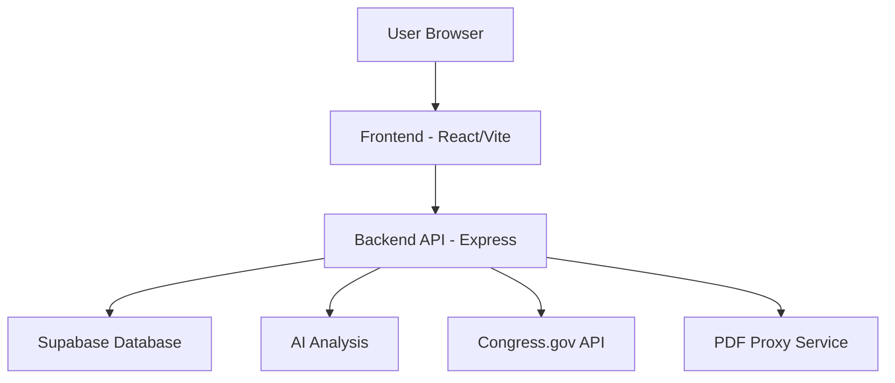
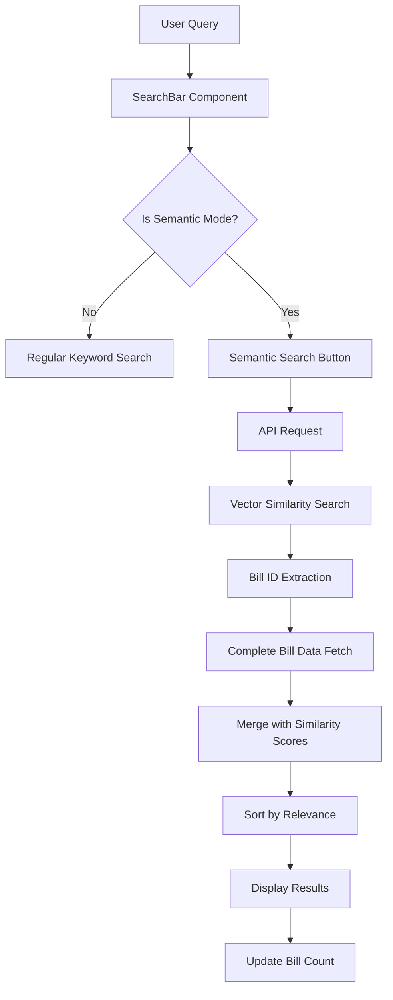
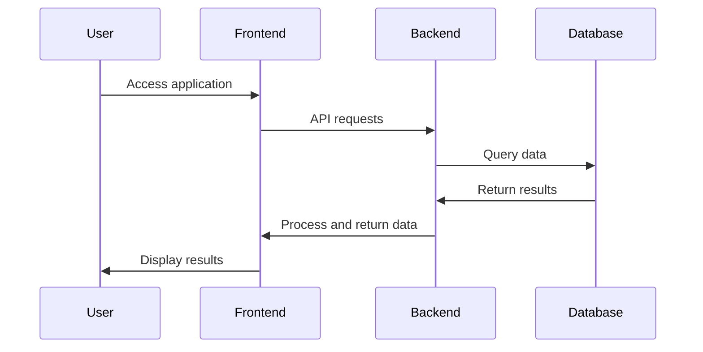
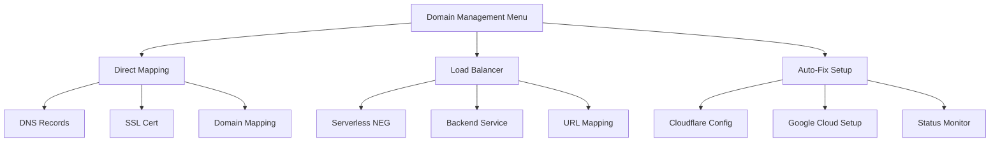
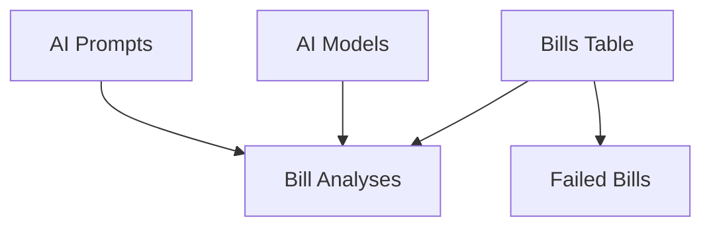

# 📊 DOGEPLOT - Congressional Bill Tracker

## 🔍 What is DOGEPLOT?

DOGEPLOT is a modern, AI-powered web application that tracks and analyzes congressional bills. It helps users stay informed about legislation by providing:

- **Real-time bill tracking** from Congress.gov
- **AI-powered bill analysis** that extracts key points and summaries
- **Semantic search** allowing you to find bills by meaning, not just keywords
- **User-friendly interface** with filtering, sorting, and detailed bill views
- **High-performance caching** for fast response times and reduced API load

DOGEPLOT is built with React, TypeScript, and Vite, and uses Supabase for the backend database. It leverages AI models to provide deeper insights into legislative content.


## ✨ Key Features

### Bill Tracking & Analysis
- **Comprehensive Bill Data**: Track titles, sponsors, committees, status updates, and full text
- **AI-Powered Analysis**: Automatic extraction of key points and summaries
- **Status Timeline**: Visual representation of a bill's journey through Congress
- **PDF Integration**: View and analyze full bill text from official PDFs

### Advanced Search Capabilities
- **Semantic Search**: Find bills based on meaning rather than just keywords
- **Filtering Options**: Search by date, status, bill type, sponsor, and more
- **Relevance Scoring**: See how closely each bill matches your search query
- **Adjustable Precision**: Control search precision with similarity threshold sliders
- **Optimized Caching**: Frequently used searches are cached for instant results

### Modern User Experience
- **Responsive Design**: Works on desktop, tablet, and mobile devices
- **Dark/Light Modes**: Toggle between viewing preferences
- **Infinite Scrolling**: Seamlessly browse through hundreds of bills
- **Real-time Updates**: Daily synchronization with Congress.gov data

### Performance Optimizations
- **LRU Caching**: Least Recently Used caching strategy for optimal memory usage
- **Server-side Caching**: 24-hour TTL for bill statistics and trending bills
- **Semantic Search Caching**: Frequently used searches are instantly available
- **Cache Management**: Easy reset functionality for administrators

## 🚀 Getting Started

### Prerequisites
- Node.js 18+ and npm
- Supabase account (for database)
- API keys for Congress.gov and OpenRouter (for AI capabilities)

### Environment Setup

DOGEPLOT uses separate environment files for different deployment contexts:
- `.env.production` - For production deployment
- `.env.staging` - For staging/testing deployment

Example environment files are provided (`.env.production.example` and `.env.staging.example`) to help you set up your own environment.

### Quick Setup

1. **Clone the repository**
   ```bash
   git clone https://github.com/yourusername/dogeplot.git
   cd dogeplot
   ```

2. **Install dependencies**
   ```bash
   npm install
   ```

3. **Set up environment variables**
   Create a `.env` file with:
   ```
   VITE_SUPABASE_URL=your_supabase_url
   VITE_SUPABASE_ANON_KEY=your_supabase_anon_key
   VITE_OPENROUTER_API_KEY=your_openrouter_api_key
   VITE_CONGRESS_API_KEY=your_congress_api_key
   ```

4. **Run the development server**
   ```bash
   npm run dev
   ```

5. **Or use our menu system for easier setup**
   ```bash
   npm run menu
   ```

## 🛠️ Development Guide

### Available Commands

#### Development
```bash
# Standard development
npm run dev

# With API proxy for PDF handling
npm run dev:proxy

# Menu system for all commands
npm run menu
```

#### Building
```bash
# Production build
npm run build:production

# Staging build
npm run build:staging
```

#### Deployment
```bash
# Deploy frontend
npm run build:production
# Then deploy to your hosting platform

# Deploy backend
npm run deploy:cloud:prod
```

### Architecture Overview

DOGEPLOT uses a hybrid architecture with separate frontend and backend components:



- **Frontend**: React application with Tailwind CSS for styling
- **Backend**: Express server handling API requests, PDF proxying, and AI processing
- **Database**: Supabase PostgreSQL with vector embeddings for semantic search
- **Deployment**: Separated deployment for frontend (static hosting) and backend (Google Cloud Run)

## 🌟 Semantic Search

DOGEPLOT features a powerful semantic search system that allows you to find bills based on meaning rather than just keywords:

1. Toggle the "Semantic Search" switch in the search bar
2. Enter your search query (e.g., "bills about climate change")
3. Click the "Search" button
4. View results sorted by relevance with similarity scores

Under the hood, this uses:
- Vector embeddings of bill text for semantic understanding
- Similarity calculation between your query and all bills
- Adjustable threshold to control precision

## 📚 Database Structure

DOGEPLOT uses a PostgreSQL database with the following key tables:

- **Bills**: Stores comprehensive bill information
- **Bill Status History**: Tracks changes in bill status
- **AI Models**: Configures different AI models for analysis
- **AI Prompts**: Stores prompts used for bill analysis
- **Bill Analyses**: Records AI analysis results

## 📋 Project Structure

```
/
├── src/
│   ├── components/     # React components
│   │   ├── ui/         # Base UI components
│   │   ├── BillFeed.tsx # Main bill display
│   │   └── ...
│   ├── lib/            # Utilities and shared code
│   ├── server/         # Express server for backend
│   ├── scripts/        # CLI tools and utilities
│   └── types/          # TypeScript type definitions
├── public/             # Static assets
└── dist/               # Build output
```

## 🔧 Configuration Options

DOGEPLOT supports multiple processing modes for handling intensive operations:

1. **Google Cloud Processing** (Default): Direct synchronous processing
2. **Inngest Processing** (High-Scale): Queue-based asynchronous processing
3. **Legacy Mode**: Original pre-hybrid implementation

Configure the mode in your environment file:
```
PROCESSOR_TYPE=google-cloud  # Options: google-cloud, inngest, legacy
```

## 🤝 Contributing

Contributions are welcome! Please check out our [Contributing Guide](CONTRIBUTING.md) for details.

## 📜 License

This project is licensed under the MIT License - see the [LICENSE](LICENSE) file for details.

## 🔗 Additional Resources

- [Congress.gov API Documentation](https://api.congress.gov/)
- [Supabase Documentation](https://supabase.io/docs)
- [Vector Embeddings Guide](https://supabase.com/docs/guides/ai/vector-embeddings)
- [OpenRouter API](https://openrouter.ai/docs)

---

# Technical Documentation

The following sections provide detailed technical information about DOGEPLOT's architecture, features, and components.

## 🚀 Version 1.0.3 Updates

### New Features

#### Enhanced Semantic Search
- **Button-Triggered Search**: Semantic search now requires explicit button activation for better user control
- **Improved Results Display**: Search results show complete bill information with proper formatting
- **Real-Time Result Count**: "Bills analyzed" count updates instantly after search completion
- **Similarity Badges**: Visual indicators showing how closely each bill matches your search query
- **Threshold Control**: Adjustable similarity threshold to fine-tune search precision

#### Deployment Architecture
- **Separated Server Deployment**: Frontend and backend now deployed separately for better scaling
- **Improved Error Handling**: Better handling of null/undefined values in search results
- **Crash Prevention**: Enhanced stability for handling large numbers of concurrent requests
- **Port Conflict Management**: New restart script to manage server port conflicts

### Technical Improvements
- **State Management**: Added force re-render mechanisms for immediate UI updates
- **Type Safety**: Improved TypeScript typing for semantic search results
- **Error Recovery**: Graceful error handling with clear user feedback
- **Performance**: Optimized bill data fetching with complete information retrieval

### How to Use Semantic Search
1. Toggle the "Semantic Search" switch in the search bar
2. Enter your search query (e.g., "bills about climate change")
3. Click the "Search" button that appears
4. View results sorted by relevance with similarity scores

## Hybrid Processing Architecture

The application uses a configurable hybrid approach for handling intensive operations like semantic search and PDF proxying:

### Processing Modes

1. **Google Cloud Processing** (Default):
   - Direct synchronous processing
   - Immediate results returned to clients
   - Suitable for development and lower-traffic scenarios
   - Uses Google Cloud credits efficiently

2. **Inngest Processing** (High-Scale):
   - Queue-based asynchronous processing
   - Background job execution with caching
   - Better handling of rate limits and concurrent requests
   - Scales to 1000+ concurrent users
   - Includes polling mechanism for result retrieval

3. **Legacy Mode**:
   - Original pre-hybrid implementation
   - Simple direct processing for backwards compatibility

### Switching Between Modes

Configure the processing mode in your environment file:

```
# In .env.staging or .env.production
PROCESSOR_TYPE=google-cloud  # Options: google-cloud, inngest, legacy
```

### Running Locally

Use our menu system for the easiest setup:

```bash
npm run menu
# Select option 8 for Server Operations
```

Or run specific commands:

```bash
# Run with Google Cloud processing (default)
npm run server:staging

# Run with Inngest processing (high scale)
npm run server:staging:inngest  # In terminal 1
npm run inngest:dev             # In terminal 2
```

## Frontend Architecture

### 🧩 Tech Stack

- **React 18**: Component-based UI with hooks for state management
- **TypeScript**: Type-safe code with Supabase type generation
- **Vite**: Fast build tool with HMR and efficient bundling
- **React Router**: Declarative routing with nested routes
- **Tailwind CSS**: Utility-first CSS framework for styling
- **Radix UI**: Accessible UI primitives for components
- **Supabase Client**: Direct database access from the frontend
- **OpenAI Integration**: API for bill analysis and embeddings

### 🔄 State Management

The application uses React's built-in state management:
- Component state with `useState`
- Context API with `useContext` (e.g., theme provider)
- Props passing for component communication
- Direct Supabase queries for data management

### 🎨 Styling System

- **Tailwind CSS**: Utility classes with custom configuration
- **Custom Components**: Shadcn-style components built on Radix UI
- **Dark Mode**: Fully supported with theme switching
- **Custom Utilities**: Special components like glass panels and gradients
- **Responsive Design**: Mobile-first approach with breakpoints

### 🔑 Key Components

1. **BillFeed**: 
   - Displays list of bills with filtering options
   - Infinite scrolling for loading more bills
   - Integration with search functionality

2. **BillDialog**:
   - Detailed view of selected bill
   - Shows bill text, status, and AI analysis
   - Progress tracking and timeline visualization

3. **SearchBar**:
   - Text search with suggestions
   - Vector-based semantic search capability
   - Filtering options by date, status, and bill type

4. **Header**:
   - Navigation controls
   - Environment indicator
   - Theme switching controls

### ⚙️ Environment Configurations

The application supports multiple environments:
- **Development**: Local development setup
- **Staging**: Testing environment with staging database
- **Production**: Live production environment
- **Proxy Variants**: For each environment with API proxy

## 🔍 Semantic Search Implementation

### Architecture Overview



### Technical Implementation

1. **Vector Embeddings**:
   - Bill text is converted to vector embeddings during synchronization
   - Uses advanced embedding models for semantic understanding
   - Stored in a vector-enabled database for efficient similarity search

2. **Search Process**:
   ```typescript
   // Two-step search process
   const performSemanticSearch = async (query, threshold) => {
     // Step 1: Get semantic matches with similarity scores
     const semanticResults = await semanticSearchBillsByText({
       query, threshold, limit: 50
     });
     
     // Step 2: Extract bill IDs and fetch complete data
     const billIds = semanticResults.map(bill => bill.id);
     const { bills: completeBills } = await fetchBills({
       billIds: billIds
     });
     
     // Step 3: Merge and sort by similarity
     const processedResults = completeBills.map(bill => ({
       ...bill,
       similarity: semanticResults.find(b => b.id === bill.id)?.similarity
     })).sort((a, b) => (b.similarity || 0) - (a.similarity || 0));
     
     // Update UI
     setBills(processedResults);
   };
   ```

3. **UI Components**:
   - **Search Toggle**: Switch between keyword and semantic search
   - **Threshold Slider**: Adjust similarity threshold (0.1-0.9)
   - **Search Button**: Trigger semantic search only when ready
   - **Similarity Badges**: Visual indicators of match relevance
   - **Result Count**: Real-time display of found matches

4. **Performance Optimizations**:
   - Lazy loading of results
   - Debounced search to prevent excessive API calls
   - Force re-render mechanisms for immediate UI updates
   - Caching of frequently accessed bills

### User Experience Improvements

1. **Explicit Search Triggering**:
   - Search button only appears in semantic mode
   - Prevents accidental heavy API calls
   - Gives users control over when to execute search

2. **Visual Feedback**:
   - Loading indicators during search
   - Match count updates instantly
   - Similarity badges show relevance at a glance
   - Clear "No results" messaging with helpful suggestions

3. **Error Handling**:
   - Graceful recovery from failed searches
   - Clear error messages
   - Option to switch to regular search
   - Automatic threshold adjustment suggestions

## Separated Deployment Architecture

DOGEPLOT uses a separated deployment architecture for improved scalability and reliability:

### Frontend Deployment
- **Platform**: Vercel or similar static hosting
- **Build Process**: `npm run build:production`
- **Deployment Frequency**: On feature completion
- **Scaling**: Automatic CDN-based scaling

### Backend Deployment
- **Platform**: Google Cloud Run
- **Build Process**: `npm run deploy:cloud:prod`
- **Deployment Frequency**: As needed for API changes
- **Scaling**: Auto-scaling based on request load
- **Resource Allocation**: Configurable CPU and memory

### Communication Flow


### Benefits of Separated Deployment
1. **Independent Scaling**: Frontend and backend can scale independently
2. **Reduced Downtime**: Updates to one component don't affect the other
3. **Optimized Resources**: Backend resources allocated only when needed
4. **Improved Security**: Backend services not directly exposed to users
5. **Better Monitoring**: Separate monitoring for each component

## DOGEPLOT Domain Management System

### 🌐 Domain Management Overview

The domain management system provides automated setup and configuration for custom domains using Google Cloud Run and Cloudflare. It handles both direct domain mapping and load balancer configurations.

### 🔑 Key Components

1. **Direct Domain Mapping**
   - Single region deployment
   - Managed SSL certificates
   - Cloudflare integration
   - Quick setup process

2. **Load Balancer Setup**
   - Global CDN and caching
   - DDoS protection
   - Multi-region support
   - Edge SSL termination

### 🛠️ System Architecture



### 📋 Common Issues and Solutions

1. **SSL Certificate Issues**
   ```bash
   Root Cause: Cloudflare proxy interfering with certificate validation
   Solution:
   - Disable Cloudflare Universal SSL
   - Set ACME challenge records to DNS-only
   - Use Full (strict) mode in Cloudflare
   ```

2. **Domain Verification Problems**
   ```bash
   Root Cause: DNS propagation or incorrect records
   Solution:
   - Ensure correct A/AAAA records
   - Set up verification TXT record
   - Wait for DNS propagation (5-10 minutes)
   ```

3. **Certificate Provisioning Delays**
   ```bash
   Root Cause: Google Cloud certificate provisioning time
   Solution:
   - Wait 15-30 minutes for provisioning
   - Monitor status with built-in tools
   - Verify DNS records are correct
   ```

## Database Structure and Migrations

### 📊 Database Schema



### Core Tables

1. **Bills Table with Status ENUM**
   ```sql
   -- Bill Status ENUM
   CREATE TYPE bill_status AS ENUM (
     'introduced',
     'referred_to_committee',
     'reported_by_committee',
     'passed_chamber',
     'passed_both_chambers',
     'presented_to_president',
     'signed_into_law',
     'vetoed',
     'veto_overridden',
     'failed'
   );

   -- Text Source ENUM
   CREATE TYPE text_source_type AS ENUM (
     'api',  -- Text obtained from Congress.gov API
     'pdf'   -- Text extracted from PDF document
   );

   -- Bills Table
   CREATE TABLE bills (
     id UUID PRIMARY KEY,
     bill_number VARCHAR NOT NULL,
     congress VARCHAR NOT NULL,
     title TEXT NOT NULL,
     introduction_date TIMESTAMP WITH TIME ZONE,
     key_points TEXT[] DEFAULT '{}',
     analysis TEXT,
     status bill_status NOT NULL DEFAULT 'introduced',
     analysis_status VARCHAR NOT NULL DEFAULT 'pending',
     sponsors TEXT[] DEFAULT '{}',
     committee TEXT,
     full_text TEXT,
     has_full_text BOOLEAN DEFAULT FALSE,
     text_source text_source_type NULL,  -- Tracks source of bill text
     pdf_url TEXT,                       -- URL to PDF document
     related_bills JSONB DEFAULT '[]',
     bill_type VARCHAR,
     origin_chamber VARCHAR,
     origin_chamber_code VARCHAR,
     latest_action_date TIMESTAMP WITH TIME ZONE,
     latest_action_text TEXT,
     constitutional_authority_text TEXT,
     policy_area VARCHAR,
     subjects TEXT[] DEFAULT '{}',
     summary TEXT,
     cbo_cost_estimates JSONB DEFAULT '[]',
     laws JSONB DEFAULT '[]',
     committees_count INTEGER DEFAULT 0,
     cosponsors_count INTEGER DEFAULT 0,
     withdrawn_cosponsors_count INTEGER DEFAULT 0,
     actions_count INTEGER DEFAULT 0,
     update_date TIMESTAMP WITH TIME ZONE,
     update_date_including_text TIMESTAMP WITH TIME ZONE,
     created_at TIMESTAMP WITH TIME ZONE DEFAULT timezone('utc', now()),
     updated_at TIMESTAMP WITH TIME ZONE DEFAULT timezone('utc', now())
   )
   ```

2. **Bill Status History Table**
   ```sql
   CREATE TABLE bill_status_history (
     id UUID PRIMARY KEY DEFAULT gen_random_uuid(),
     bill_id UUID NOT NULL REFERENCES bills(id) ON DELETE CASCADE,
     status bill_status NOT NULL,
     changed_at TIMESTAMP WITH TIME ZONE DEFAULT timezone('utc', now()),
     action_text TEXT,  -- Stores Congress API action that triggered the change
     CONSTRAINT fk_bill_id FOREIGN KEY (bill_id) REFERENCES bills(id)
   )
   ```

3. **Failed Bills Table**
   ```sql
   CREATE TABLE failed_bills (
     id UUID PRIMARY KEY DEFAULT uuid_generate_v4(),
     congress VARCHAR NOT NULL,
     bill_type VARCHAR NOT NULL,
     bill_number VARCHAR NOT NULL,
     title TEXT,
     error_message TEXT NOT NULL,
     retry_count INTEGER DEFAULT 0,
     last_retry TIMESTAMP WITH TIME ZONE,
     status VARCHAR NOT NULL DEFAULT 'failed',
     created_at TIMESTAMP WITH TIME ZONE DEFAULT timezone('utc', now()),
     updated_at TIMESTAMP WITH TIME ZONE DEFAULT timezone('utc', now())
   )
   ```

### AI-Related Tables

1. **AI Models**
   ```sql
   CREATE TABLE ai_models (
     id UUID PRIMARY KEY DEFAULT uuid_generate_v4(),
     name VARCHAR NOT NULL,
     provider VARCHAR NOT NULL DEFAULT 'openrouter',
     model_id VARCHAR NOT NULL,
     is_active BOOLEAN DEFAULT false,
     cost_per_1k_tokens DECIMAL(10,6),
     max_tokens INTEGER,
     created_at TIMESTAMP WITH TIME ZONE DEFAULT timezone('utc', now()),
     updated_at TIMESTAMP WITH TIME ZONE DEFAULT timezone('utc', now())
   )
   ```

2. **AI Prompts**
   ```sql
   CREATE TABLE ai_prompts (
     id UUID PRIMARY KEY DEFAULT uuid_generate_v4(),
     name VARCHAR NOT NULL,
     system_prompt TEXT NOT NULL,
     user_prompt TEXT NOT NULL,
     is_active BOOLEAN DEFAULT false,
     created_at TIMESTAMP WITH TIME ZONE DEFAULT timezone('utc', now()),
     updated_at TIMESTAMP WITH TIME ZONE DEFAULT timezone('utc', now())
   )
   ```

3. **Bill Analyses**
   ```sql
   CREATE TABLE bill_analyses (
     id UUID PRIMARY KEY DEFAULT uuid_generate_v4(),
     bill_id UUID REFERENCES bills(id) ON DELETE CASCADE,
     model_id UUID REFERENCES ai_models(id),
     prompt_id UUID REFERENCES ai_prompts(id),
     raw_response TEXT,
     processed_response JSONB,
     tokens INTEGER,
     cost DECIMAL(10,6),
     processing_duration DECIMAL(10,2),
     created_at TIMESTAMP WITH TIME ZONE DEFAULT timezone('utc', now()),
     updated_at TIMESTAMP WITH TIME ZONE DEFAULT timezone('utc', now())
   )
   ```

### 🔄 Database Migrations

DOGEPLOT provides tools for database management including new database setup and updates:

```bash
# Complete reset and new setup
npm run db:new

# Apply updates to existing database
npm run db:update

# From menu system
npm run menu
# Select option 4 for Database Management
```

### 🔒 Security and Permissions

DOGEPLOT implements Row Level Security (RLS) and proper access policies:

```sql
-- Enable RLS on all tables
ALTER TABLE bills ENABLE ROW LEVEL SECURITY;

-- Allow public read access
CREATE POLICY "Enable read access for all users on bills"
ON bills FOR SELECT TO public USING (true);

-- Allow full access for service role
CREATE POLICY "Enable full access for service role on bills"
ON bills FOR ALL TO service_role
USING (true) WITH CHECK (true);
```

## 🔄 Development Workflow and Best Practices

### Commit Message Format
We use standardized commit messages in the following format:
```
Feat(component): add new component
Fix(api): fix api error
Docs(readme): update readme
Refactor(utils): refactor utils
Style(tailwind): add new tailwind class
Test(unit): add unit test
Chore(deps): update dependencies
```

### ESLint Configuration
For production applications, we recommend enabling type-aware lint rules:

```js
export default {
  // other rules...
  parserOptions: {
    ecmaVersion: 'latest',
    sourceType: 'module',
    project: ['./tsconfig.json', './tsconfig.node.json'],
    tsconfigRootDir: __dirname,
  },
}
```

## 🔍 Troubleshooting & Common Issues

### SSL and Domain Issues
1. **Certificate Not Provisioning**
   - Check DNS records are correct
   - Verify Cloudflare proxy settings
   - Ensure ACME challenge is accessible

2. **Domain Not Resolving**
   - Verify A/AAAA records
   - Check DNS propagation
   - Confirm Google Cloud mapping

### Build and Deployment Issues
```bash
Problem: Build failing
Solution:
1. Check environment:
   - Verify .env files
   - Check VITE_MODE
2. Clean and rebuild:
   - npm run refresh
   - npm run build
```

### Server Issues
```bash
Problem: Server port conflicts
Solution:
1. Check for running processes:
   - lsof -i :3000
2. Kill conflicting process:
   - kill -9 [PID]
3. Use restart script:
   - npm run server:restart
```
